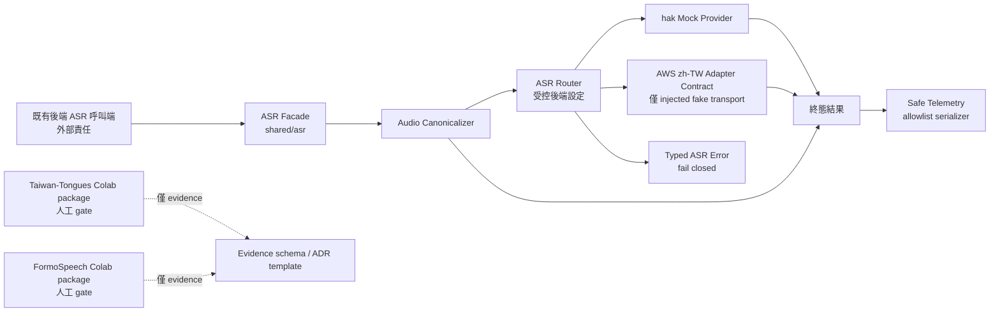

# ASR 模型整合 — 技術設計（ASR-only）

## 1. 目的、交付範圍與硬性邊界

本期交付一個可由既有後端呼叫端獨立整合的 ASR 領域套件。套件只處理音訊正規化、內部設定與路由、Provider Contract、`hak` mock、未指定 AWS 服務的 `zh-TW` adapter contract、安全終態遙測，以及模型人工驗證所需的 Colab/evidence/ADR 契約。所有程式示意均為 Python 3.11 型別輪廓或結構化偽碼，**不是實作**。

### 本期包含

- `backend/src/shared/asr/` 的 domain types、Canonical Audio、設定、router、provider protocol、`hak` mock、AWS `zh-TW` adapter contract、safe telemetry、evidence/ADR validator。
- Taiwan-Tongues-ASR-CE 與 FormoSpeech Whisper-v3 的**免費 Colab 人工驗證包**、精確釘選安裝清單、結構化去識別化證據格式與 ADR Markdown 範本。
- 不連外的 ASR-only 測試設計：單元測試、fixture 測試與五組必要 property tests。

### 明確不包含

以下項目僅是未來的外部呼叫端、外部責任或部署負責人 gate；本設計不修改、設計、測試或要求其變更：

- `backend/src/handlers/chat.py`、公開 Chat request/response/error、`docs/api.md`。
- idempotency、session reserve/replay、Agent/Bedrock、routine/event 副作用、原子交易、Agent/session persistence。
- Flutter 程式、畫面、請求或設定。
- AWS 真實服務或 Region 選擇、SDK/network call、endpoint、Terraform、IAM、S3、部署資源或 production invocation。

既有後端呼叫端未來只在其自身已完成輸入驗證與授權後，呼叫 ASR 套件並自行決定如何處理 `Transcript` 或 `TypedAsrError`。ASR 領域不理解 HTTP、API schema、資料庫或對話工作流。

## 2. 目標架構



- **Facade** 是 ASR-only 的單一入口：輸入 Audio Bytes、Input Format、Language、Deadline、Cancellation Signal、Correlation Context；輸出 `Transcript | TypedAsrError` 與一筆終態 Safe Telemetry。
- **Canonicalizer** 是 source-audio 與 provider 的唯一邊界。它驗證容器一致性、解碼並生成 Canonical Audio；Provider 無法接收 WAV/M4A 原始 bytes。
- **Router** 只讀取後端受控設定。呼叫端不可選 provider、模型、服務或 Region。
- **`hak` mock** 是唯一可啟用的客語 provider，回傳固定安全測試文字，無模型、網路或雲端呼叫。
- **AWS `zh-TW` adapter** 僅定義未來 adapter 所需的輸入、deadline、cancel、結果與錯誤正規化契約；本期沒有真實 AWS transport。
- **Colab** 與 production route 完全隔離。CE/Formo 的證據不能變更 router 設定或開啟 production invocation。

## 3. 元件與建議檔案邊界

| 位置 | 元件 | 責任 | 禁止依賴 |
|---|---|---|---|
| `backend/src/shared/asr/__init__.py` | 公開表面 | 僅 re-export facade、types、router protocol | handlers、HTTP、DB |
| `backend/src/shared/asr/types.py` | 領域型別 | Audio/結果/錯誤/context/deadline/cancel 的不可變型別與驗證 | AWS SDK、codec、telemetry sink |
| `backend/src/shared/asr/canonical_audio.py` | Audio Canonicalizer | WAV/M4A 驗證、解碼、mono/16 kHz/PCM S16LE 正規化與時長 gate | router、provider、HTTP |
| `backend/src/shared/asr/config.py` | 受控設定 | language route、provider state、model metadata、AWS capability gate、Formo allowlist | 環境自動選服務/Region |
| `backend/src/shared/asr/router.py` | ASR Router/Facade | canonicalize 後依設定選 provider；統一終態 | Chat/session/Agent |
| `backend/src/shared/asr/providers.py` | Provider Protocol | 定義 provider 與 test-only fake transport contract | AWS SDK、網路 client |
| `backend/src/shared/asr/hak_mock.py` | hak Mock Provider | 決定性、非空白、安全測試 Transcript | 模型、網路、音訊回顯 |
| `backend/src/shared/asr/aws_zh_adapter.py` | AWS `zh-TW` Adapter Contract | gate、fake transport 邊界、deadline/cancel、輸出/錯誤正規化 | 真實 AWS service/SDK/IAM/S3 |
| `backend/src/shared/asr/telemetry.py` | Safe Telemetry | allowlist 序列化與每 invocation 一次終態發送 | 原始 exception/provider response |
| `backend/src/shared/asr/evidence.py` | evidence/ADR validation | 結構化 evidence schema、ADR reference projection/template rule | Notebook runtime、HF token |
| `backend/asr_colab/` | 兩個人工驗證包 | notebook、immutable dependency manifest、fixture provenance、evidence output | Lambda deployment artifact |
| `docs/adr/` | ADR 範本 | 模型驗證決策與外部 gate 的可追溯紀錄 | production enablement |
| `backend/tests/asr/` | ASR-only tests | 不連外的必要單元、fixture、property tests | Chat、Bedrock、AWS、Flutter、Terraform |

所有 `shared/asr` 模組只能向內依賴同一套件與標準函式庫/已核准的 local decoding abstraction；不得 import `handlers.chat`、`src.shared.db`、API response helpers 或基礎設施 SDK。

## 4. 領域資料模型與介面

### 4.1 值物件與結果代數型別

| 型別 | 不變條件 |
|---|---|
| `InputFormat` | 僅 `wav`、`m4a`。其他值是 `unsupported_audio_format`。 |
| `Language` | 僅 `zh-TW`、`hak`。未知值是 `unsupported_language`。 |
| `CorrelationContext` | 僅持有非空白、不透明 `correlation_id`；不可帶 audio、transcript、token、長者資料、prompt ID 或任意呼叫端 metadata。 |
| `CanonicalAudio` | `pcm_s16le` sample bytes、`sample_rate_hz=16000`、`channels=1`、`sample_width_bits=16`、精確 `duration_ms`，以及僅供診斷的原始 `input_format`。不得序列化到 telemetry/evidence。 |
| `Deadline` | 呼叫端提供的單調時鐘絕對到期時刻；可由 injected monotonic clock 判斷，不使用 wall clock。 |
| `CancellationSignal` | 可查詢的協作式取消狀態；一旦觸發不可回復。 |
| `Transcript` | 經 Unicode trim 後非空白的文字。它只存在於 ASR 成功結果，不能寫入 Safe Telemetry/evidence/ADR。 |
| `TypedAsrError` | 固定 `category`、安全 `message`、`retryable`；不得承載 raw exception、audio、token 或 provider raw response。 |
| `AsrTerminalResult` | 互斥 union：`Transcript` 或 `TypedAsrError`，不存在第三種或 partial 狀態。 |

`TypedAsrError.category` 完整列舉：`invalid_audio`、`unsupported_audio_format`、`audio_duration_exceeded`、`unsupported_language`、`route_not_approved`、`deadline_exceeded`、`cancelled`、`provider_unavailable`、`provider_invalid_response`、`provider_failure`。

### 4.2 Python 型別輪廓（非實作）

```python
# 僅為介面設計，非可執行程式
class AsrFacade(Protocol):
    def recognize(
        self,
        audio_bytes: bytes,
        input_format: InputFormat,
        language: Language,
        deadline: Deadline,
        cancellation: CancellationSignal,
        context: CorrelationContext,
    ) -> AsrTerminalResult: ...

class AudioCanonicalizer(Protocol):
    def canonicalize(
        self, audio_bytes: bytes, input_format: InputFormat
    ) -> CanonicalAudio | TypedAsrError: ...

class AsrProvider(Protocol):
    provider_id: str

    def transcribe(
        self,
        audio: CanonicalAudio,
        language: Language,
        deadline: Deadline,
        cancellation: CancellationSignal,
        context: CorrelationContext,
    ) -> Transcript | TypedAsrError: ...
```

`AsrFacade` 是唯一可以同時持有 source audio 與 router 的元件；`AsrProvider.transcribe` 的第一個音訊參數永遠是 `CanonicalAudio`。型別和建構子必須使 raw `bytes` 無法被 provider/transport 誤當成合法輸入。

### 4.3 音訊時長表示與比較

Canonicalizer 以 decoder 回報的 frame count/sample rate 計算時長，保留足以無損比較 60 秒門檻的精度，再暴露為毫秒數值 `duration_ms`。實作不可先向下或向上粗略取整再判定：

- `59.999 s`（`59999 ms`）與 `60.000 s`（`60000 ms`）必須接受。
- `60.001 s`（`60001 ms`）必須回 `audio_duration_exceeded`。
- 任何無法安全解碼或宣告格式與容器內容不一致的輸入，均為 `invalid_audio`，不應將猜測的時長當作有效資料。

## 5. Canonical Audio 流程

1. **輸入 gate：** 空白 `audio_bytes` 回 `invalid_audio`；format 非 `wav`/`m4a` 回 `unsupported_audio_format`。
2. **容器一致性：** 以宣告格式解碼，並確認檔案內容確為相符 WAV 或 M4A。損毀 bytes、缺 audio stream、codec/decode failure、WAV/M4A 宣告與內容不符，皆回 `invalid_audio`。
3. **精確時長 gate：** 在完整轉送 provider 前計算時長。時長大於 `60.000 s` 回 `audio_duration_exceeded`。
4. **轉換：** 對可接受來源完成 decode、downmix 到單聲道、resample 至 16,000 Hz，並輸出 16-bit signed little-endian PCM。
5. **封裝：** 建立唯讀 `CanonicalAudio`；source bytes、temporary decoded buffers 與 codec diagnostics 不離開 canonicalizer。

本設計不選擇或部署特定 decoding library、FFmpeg layer、container 或 native package。實作階段對 decoder 的選擇必須另經後端相依性審查，且不改變上述領域合約。

## 6. 後端設定、模型 metadata 與路由

### 6.1 設定模型

設定由後端擁有的設定來源提供給 `AsrRouter`；設定來源本身、讀取機制與部署不是本期範圍。解析失敗、未知 schema version、缺必填鍵或相互矛盾的狀態一律 fail closed。

| 設定區塊 | 必填資料 | 規則 |
|---|---|---|
| `routes[zh-TW]` | route、provider identifier、enabled state | 唯一候選是 AWS `zh-TW` adapter contract；不含 AWS service/Region。 |
| `routes[hak]` | route、provider identifier、enabled state | 啟用時只可導向 `hak_mock`。 |
| `providers` | provider identifier、status、metadata reference | identifier 不由 caller 輸入。 |
| `model_metadata` | model ID、version/revision、license、access status、usage restriction、approval state | CE/Formo 均標示 `colab_validation_only`。 |
| `formo_prompt_id` | allowlist | 僅六個需求指定值。 |
| `aws_capability_gate` | 逐項核准旗標與 approval record reference | 任何缺項/false/不可讀皆為未核准。 |

固定模型 metadata：

| 模型 | model ID | 使用限制 |
|---|---|---|
| Taiwan-Tongues-ASR-CE | `adi-gov-tw/Taiwan-Tongues-ASR-CE-v2.0` | `zh`、`hak`；license `other`；僅限 Colab 驗證。 |
| FormoSpeech Whisper-v3 | `formospeech/whisper-large-v3-taiwanese-hakka` | `CC BY-NC 4.0`、gated access；僅限 Colab 驗證。 |

上述兩筆 metadata 不等同於可用 provider。無論 metadata 欄位如何填寫，Production Invocation route 都必須回 `route_not_approved` 並維持 transport zero-call。

### 6.2 路由決策表

| 條件 | 路由結果 | transport calls |
|---|---|---:|
| language 不在 allowlist | `unsupported_language` | 0 |
| `hak` route 啟用且 provider 為 `hak_mock` | `HakMockProvider` | 0（無 transport） |
| `hak` 無 route、disabled 或 provider 非 mock | `route_not_approved` | 0 |
| CE/Formo 任一 Production Invocation route | `route_not_approved` | 0 |
| `zh-TW` 的 AWS capability gate 不完整/未核准 | `route_not_approved` | 0 |
| `zh-TW` gate 完整，且 preflight cancellation 已觸發 | `cancelled` | 0 |
| `zh-TW` gate 完整，deadline 已到期 | `deadline_exceeded` | 0 |
| `zh-TW` gate 完整且使用 injected fake transport 的 ASR-only test | AWS adapter contract 結果 | 最多 1 |

判定順序固定為：**語言有效性 → route/production 禁止 → capability gate → cancellation → deadline → fake transport**。因此未核准 AWS route 在任何情況都以 `route_not_approved` 結束，絕不因取消或逾期而觸發 transport。

### 6.3 hak Mock Provider

`HakMockProvider` 在啟用時接受有效的 `CanonicalAudio`、`hak`、deadline、cancellation 與 context，並回傳固定、非空白 Unicode 測試 Transcript。輸出不得根據 audio samples、source bytes、caller supplied text、完整逐字稿或 prompt 變化；它不會建立模型、網路或雲端呼叫。若 preflight deadline/cancellation 已達終態，router 依一般規則先回相應 Typed ASR Error。

## 7. AWS `zh-TW` Adapter Contract（未選服務、fail closed）

### 7.1 不可變決策

本期**不選擇** AWS service、AWS Region、服務輸入/輸出模式、endpoint、SDK 或真實 transport。adapter 不 import AWS SDK，不建立 network client，也不假設 IAM/S3 存在。任何將這些內容填入設定或程式的行為均屬後續部署工作，不是本期交付。

### 7.2 Capability Gate

`AwsCapabilityGate` 必須引用可追溯 approval record，並且以下每一項皆明確核准才是完整：

1. 指定 Region 支援 `zh-TW`。
2. 選定服務的輸入與輸出模式。
3. Canonical PCM 相容性。
4. timeout 行為。
5. cancellation 行為。
6. IAM 必要權限。
7. 是否需要 S3。
8. S3 結果處理方式。
9. S3 清理需求。

本期 gate 預設不完整。Router/adapter 以全項 AND 判斷；任一遺漏、false、未知 approval record 或 parser error 都回 `route_not_approved` 且 **zero transport calls**。部署負責人日後要核實真實服務、IAM、S3、Region 與部署資源，必須另立 deployment gate；Colab evidence 不能替代此核准。

### 7.3 Injected Fake Transport 的精確契約

`InjectedFakeTransport` 是 ASR-only tests 唯一允許注入的 transport；它是測試 double，不是 production adapter。

| 面向 | 契約 |
|---|---|
| 建構 | 僅測試 composition root 可注入。production composition root 不提供 SDK/network transport，也不應建立 adapter 的可呼叫 transport。 |
| 輸入 | `TransportRequest` 只含 `CanonicalAudio`、固定 `language="zh-TW"`、`Deadline`、`CancellationSignal`、`CorrelationContext.correlation_id`。不得含 raw WAV/M4A bytes、HTTP payload、provider/endpoint/Region、HF Token、prompt ID。 |
| deadline | 為單調絕對時刻；fake transport 必須在呼叫前與處理中協作檢查。adapter 在呼叫前後也檢查，成功不可覆蓋已逾期終態。 |
| cancellation | 訊號一旦觸發，fake transport 必須停止工作並回已取消終態或讓 adapter 偵測到取消；成功不可覆蓋已取消終態。 |
| 正常輸出 | 僅能回傳 text candidate。adapter Unicode trim 後驗證非空白，再建立 `Transcript`。 |
| 已知錯誤 | fake transport 可回/raise deadline、cancelled、unavailable 等具名 transport terminal；adapter 分別映射為 `deadline_exceeded`、`cancelled`、`provider_unavailable`。 |
| 無效輸出 | `None`、非文字、空白文字、結構不符或不可能的 terminal 組合，均為 `provider_invalid_response`。 |
| 未分類例外 | 不向上洩漏原始例外，統一為 `provider_failure`；安全 message 不含 exception text。 |
| 呼叫數 | 在完整 gate、未取消且未逾期的單次 invocation 中最多一次；所有其他分支為零。 |

結構化偽碼如下，僅描述 precedence：

```text
if capability_gate is incomplete:
    return route_not_approved; do not invoke transport
if cancellation is triggered:
    return cancelled; do not invoke transport
if monotonic_now >= deadline:
    return deadline_exceeded; do not invoke transport
candidate = injected_fake_transport.transcribe(allowed_transport_request)
if cancellation is triggered after return:
    return cancelled
if monotonic_now >= deadline after return:
    return deadline_exceeded
return validate_and_normalize(candidate)
```

這個合約沒有宣稱可在真實 blocking network call 中強制中斷。未來選定服務後，部署負責人必須把服務的 cancellation/timeout 實際能力與此契約逐項比對並完成 capability gate，才可提出新的實作需求。

## 8. Error Handling

| 發生層 | 條件 | Typed ASR Error | retryable |
|---|---|---|---|
| facade input | empty audio bytes 或缺/無效 correlation context | `invalid_audio` | false |
| canonicalizer | 不支援 input format | `unsupported_audio_format` | false |
| canonicalizer | corrupt、decode 失敗、format mismatch | `invalid_audio` | false |
| canonicalizer | duration > 60.000 秒 | `audio_duration_exceeded` | false |
| router | 未知 language | `unsupported_language` | false |
| router/adapter | route disabled、CE/Formo production、AWS gate 缺項 | `route_not_approved` | false |
| provider adapter | deadline 到期 | `deadline_exceeded` | true |
| provider adapter | cancellation signal 觸發 | `cancelled` | false |
| fake transport | 明確 unavailable | `provider_unavailable` | true |
| fake transport | blank/malformed result | `provider_invalid_response` | false |
| fake transport | 未分類例外 | `provider_failure` | true |

錯誤處理只產生領域型別。公開 HTTP status/code/message 的映射、重試政策、持久化、session 或 side effect 處理由外部呼叫端負責，且不在 ASR 設計內。

## 9. Safe Telemetry

### 9.1 資料模型與 serializer

每個 `AsrFacade.recognize` invocation 由一個 `TerminalTelemetryEmitter` 擁有 `emit_once` 狀態。無論結果是 Transcript 或 Typed ASR Error，都只能產生一個 terminal result 和一筆 telemetry；重複 finalize 必須被忽略或視為內部 invariant failure，絕不多送一筆紀錄。

輸出物件的鍵只能是以下 allowlist：

```text
correlation_id, language, route, provider_id, input_format,
canonical_sample_rate_hz, canonical_channels, audio_duration_ms,
deadline_outcome, terminal_outcome, error_category, elapsed_ms, retryable
```

| 欄位 | 規則 |
|---|---|
| `correlation_id` | 原樣不透明關聯值；不可改由 elder/session/request identifier 推導。 |
| `language`、`route`、`provider_id`、`input_format` | 設定/領域 enum 值；未路由時使用安全且固定的 route/provider sentinel。 |
| canonical 欄位與 duration | 僅 canonicalize 成功才填；不可含 sample bytes。 |
| `deadline_outcome` | `not_reached`、`deadline_exceeded` 或 `cancelled` 的終態判定。 |
| `terminal_outcome` | `success` 或 `error`。 |
| `error_category`、`retryable` | 成功為 null/false；失敗對應 Typed ASR Error。 |
| `elapsed_ms` | 從 injected monotonic clock 計算的非負數。 |

serializer 必須拒絕或丟棄所有非 allowlist fields，尤其是 Audio Bytes、Canonical Audio samples、完整 Transcript、HF Token、真實長者資料、provider raw response、raw exception、Formo Prompt ID、HTTP headers 和 endpoint/Region。telemetry sink 是可注入的本地介面；本設計不選擇 CloudWatch 或任何外部遙測服務。

### 9.2 終態流程

1. facade 建立 monotonic start time 與單一 emitter。
2. input/canonicalization/router/provider 任一層回 terminal result，即進行一次資料最小化的 telemetry projection。
3. 成功與錯誤都寫 `terminal_outcome`、`deadline_outcome`、`elapsed_ms`；錯誤再寫 `error_category` 與 `retryable`。
4. emitter 只保留「已送出」旗標，不保留 transcript/audio/raw response。

## 10. Colab 驗證包、證據與 ADR

### 10.1 套件布局與共同安全規則

```text
backend/asr_colab/
├── taiwan_tongues_asr_ce/
│   ├── README.md
│   ├── validation.ipynb
│   ├── requirements.lock
│   ├── fixture_provenance.json
│   └── evidence.schema.json
└── formospeech_whisper_v3/
    ├── README.md
    ├── validation.ipynb
    ├── requirements.lock
    ├── fixture_provenance.json
    └── evidence.schema.json

docs/adr/
└── asr-model-validation-template.md
```

每份 `requirements.lock` 必須將所有直接與轉換依賴寫成精確 `package==version`，不允許版本範圍或 optional test path；其內容摘要寫進 evidence 的 `dependency_manifest_digest`。本設計不在未驗證的情況下臆測第三方版本；實作交付時的完整鎖檔才是可重現、可審核的版本真相。

兩個 notebook 都是**人工 Colab gate**，不進 CI：

1. 明示選擇免費 GPU runtime，並先檢查 GPU/依賴/下載/decoder 前置條件。
2. 只接受由專案建立的 synthetic audio 或具合法公開使用授權且有 `fixture_provenance.json` 證明的音檔。
3. 提供 WAV 輸入與 M4A 解碼流程；任何 M4A decode failure 必須輸出 failure prerequisite/category/retry step。
4. 寫出 JSON 或 JSON Lines evidence，但不得顯示、保存或引用完整 transcript、HF Token 或 audio bytes。
5. 不建立 production endpoint，不呼叫本期的 AWS adapter，也不做 CE/Formo Production Invocation。

Taiwan-Tongues package 固定記錄 model ID、語言碼 `zh`/`hak`、license `other` 與 `colab_validation_only`。Formo package 固定記錄 model ID、`CC BY-NC 4.0`、gated-model access prerequisite 與 `colab_validation_only`；HF Token 僅從 Colab secret/短生命週期環境讀取，不能進 notebook source、cell output、evidence、ADR 或 lockfile。

### 10.2 Formo Prompt ID

Formo transcription 前的設定 validator 只接受下列六個精確值：

```text
htia_sixian, htia_hailu, htia_dapu,
htia_raoping, htia_zhaoan, htia_nansixian
```

任何其他字串（含空字串、空白、大小寫變形、前後空白與 Unicode lookalike）都必須被拒絕，不得正規化或猜測。Prompt ID 僅在 notebook 執行記憶體中交給模型 I/O mapping；它同時是 Safe Telemetry、evidence 與 ADR 的禁止欄位。

### 10.3 結構化 Evidence Schema

每筆 record 的必填欄位為：

```text
schema_version, run_id, recorded_at, model_id, model_revision, language,
input_format, input_fixture_id, audio_duration_ms, runtime_kind,
dependency_manifest_digest, outcome, failure_prerequisite,
failure_category, transcript_present, transcript_character_count,
evidence_redaction_version
```

驗證規則：

- `outcome=success` 時，`transcript_present=true` 且 `transcript_character_count` 為大於零整數；record 不可出現 `transcript` 欄位。
- `outcome=failure` 時，`failure_prerequisite` 與 `failure_category` 都必為非空白；不得以空 transcript 冒充成功。
- schema 一律拒絕包含完整 transcript、token/HF token、audio bytes/sample、prompt ID、raw provider response 或未允許的 sensitive field。
- `input_fixture_id` 只引用 fixture provenance 中的匿名 ID，不存檔名、路徑或可識別個資。

### 10.4 ADR Template Schema

ADR 是 Markdown 範本，必有下列 sections：`title`、`status`、`date`、`owners`、`scope`、`candidate_models`、`evidence_references`、`aws_capability_gate_status`、`decision`、`rationale`、`risks`、`non_goals`、`follow_up_actions`。

每一筆 `evidence_references` 只能投影：`run_id`、`model_id`、`input_fixture_id`、`outcome`、`failure_category`。`non_goals` 必須清楚標示 Taiwan-Tongues-ASR-CE 和 FormoSpeech Whisper-v3 的 Production Invocation 為本期禁止。ADR 可記錄「AWS capability gate 尚未完成」，但不得暗示或決定任何 AWS service、Region、IAM/S3 方案。

## 11. ASR-only 測試與驗證策略

### 11.1 必要安裝與執行

開發依賴必須精確釘選為：

```text
pytest==8.3.5
hypothesis==6.122.3
```

兩者都必須在 `backend` 的 `[dev]` dependencies 中，沒有 optional marker、extra gate 或 skip fallback。ASR-only 本機執行必須使用 `asr-lambda/environment.yml` 建立的 `asr-model` conda 環境，以取得已封裝的 Python、音訊解碼與 ASR 推論相依套件。唯一支援的必要執行序列是：

```bash
conda env create -f ../asr-lambda/environment.yml  # 首次建立
conda activate asr-model
python -m pip install -e ".[dev]"
python -m pytest tests/asr -q
```

任一單元、fixture 或 property test 失敗時，pytest 必以非零狀態結束。ASR-only suite 不建立網路、AWS SDK、真實模型、Chat/API、Bedrock、Flutter 或 Terraform 呼叫。

### 11.2 測試分層

| 測試類型 | 覆蓋內容 |
|---|---|
| Unit | types、config parsing、router decision、provider protocol、hak mock、AWS adapter mapping、telemetry serializer、evidence validator、ADR template validator。 |
| Fixture/edge | 短 WAV、有效 M4A、corrupt audio、format/content mismatch、59.999 s、60.000 s、60.001 s。成功 fixtures 必得 Canonical Audio；前三種錯誤/超限須各自得指定 Typed ASR Error。 |
| Property | 僅限 route/approval、adapter contract/deadline/errors、terminal telemetry、Formo prompt、evidence/ADR。每項最少 100 iterations。 |
| Manual integration gate | Colab 的 GPU、精確依賴、模型下載、gated access、WAV/M4A decode、synthetic/publicly authorized fixture provenance。這些不屬 CI。 |

fixture assertions：

| Fixture | 預期 |
|---|---|
| short WAV、valid M4A、59.999 s、60.000 s | 成功產生 16 kHz/mono/16-bit S16LE Canonical Audio。 |
| corrupt audio、format/content mismatch | `invalid_audio`。 |
| 60.001 s | `audio_duration_exceeded`。 |

### 11.3 Property test 對應

所有 property test 的 tag 必須採：`Feature: asr-model-integration, Property <N>: <title>`。

- Property 1：生成 routes、provider states 與 capability-gate 欄位組合；對不完整 gate 和 CE/Formo production route 以 spy fake transport 驗證 `route_not_approved`/zero-call。
- Property 2：生成 Canonical Audio、deadline/cancellation 時點、fake transport 成功/空白/malformed/known error/unknown exception；驗證允許輸入欄位、preflight/postflight precedence 與錯誤正規化。
- Property 3：生成 terminal outcomes 與含敏感 sentinel 的資料；驗證每個 correlation context 恰一個 terminal telemetry、allowlist keys 與內容去識別化。
- Property 4：生成任意 Unicode prompt candidate；只允許六個 Formo Prompt ID。
- Property 5：生成 success/failure evidence 與 ADR reference；驗證 schema invariants、敏感欄位拒絕、allowed evidence projection。

## 12. Correctness Properties

*正確性屬性描述所有有效執行中都必須成立的行為，作為需求與可自動驗證測試之間的橋接。每項 property test 至少執行 100 iterations。*

### Property Reflection

預先分析後，將 `3.4`、`3.7`、`4.4`、`4.5` 與 `8.7` 合併為「fail-closed route/approval」：它們共享同一組設定輸入，且 zero transport call 是 route reject 必須同時驗證的效果。將 `2.6`、`4.1`、`4.6`、`4.7`、`4.8` 與 `8.8` 合併為 adapter lifecycle property，避免分別重複測試同一 fake transport 邊界。將 `5.1` 至 `5.5` 與 `8.9` 合併為單一終態 telemetry property。`3.8`、`6.6` 與 `8.10` 是同一 Formo allowlist，合併。`6.5`、`6.10`、`7.1` 至 `7.3`、`7.5` 與 `8.11` 合併為 evidence/ADR schema 與 redaction property。

Canonical audio fixture、固定 metadata、ADR mandatory headings、精確套件版本與 Colab 前置條件均是範例、edge、smoke 或人工 integration gate，不重複偽裝成 property test。

### Property 1: 未核准路由永遠 fail closed

For all `zh-TW` AWS capability-gate 組合中缺少任一核准項目的設定，以及 for all Taiwan-Tongues-ASR-CE 或 FormoSpeech Whisper-v3 的 Production Invocation route 設定，ASR Router 都必須回傳 `route_not_approved`，且 injected fake transport 的呼叫次數必為零；for any 不在 language allowlist 的值，Router 必須回傳 `unsupported_language` 且零呼叫。

**Validates: Requirements 3.4, 3.7, 4.4, 4.5, 8.7**

### Property 2: AWS adapter 的 fake transport 邊界、deadline 與錯誤正規化

For all 完整 capability gate 下的 Canonical Audio、`zh-TW`、Deadline、Cancellation Signal 與 Correlation Context 輸入，AWS adapter 只可將這些允許欄位傳給 injected fake transport，絕不可傳入 source audio、服務、Region、endpoint、token 或 prompt；for any 已取消或已逾期的輸入，adapter 必須在不呼叫 transport 的情況下分別回傳 `cancelled` 或 `deadline_exceeded`；for any fake transport 的空白/無效輸出或未分類例外，adapter 必須分別正規化為 `provider_invalid_response` 或 `provider_failure`。

**Validates: Requirements 2.6, 4.1, 4.6, 4.7, 4.8, 8.8**

### Property 3: 終態 telemetry 唯一且不含敏感內容

For all ASR success、cancelled、deadline-exceeded 與 error terminal outcomes，以及 for any 包含 audio、transcript、HF token、長者資料、raw response 或 Formo Prompt ID sentinel 的內部輸入，每組 Correlation Context 都必須產生恰一個 terminal result 與恰一筆 Safe Telemetry；該 telemetry 的鍵只能是 allowlist，並正確包含 terminal/deadline outcome、elapsed time 與適用的 error category，而不得包含任何 sentinel 或禁止欄位。

**Validates: Requirements 5.1, 5.2, 5.3, 5.4, 5.5, 8.9**

### Property 4: Formo Prompt ID 精確 allowlist

For any Unicode 字串作為 Formo Prompt ID，設定與 Colab validation input 當且僅當它精確等於 `htia_sixian`、`htia_hailu`、`htia_dapu`、`htia_raoping`、`htia_zhaoan` 或 `htia_nansixian` 時才可接受；所有其他字串都必須被拒絕，且不得被寫入 Safe Telemetry、evidence 或 ADR。

**Validates: Requirements 3.8, 6.6, 8.10**

### Property 5: Evidence/ADR schema、終態一致性與去識別化

For all 結構化 evidence records，當 record 成功時它必須具有 `transcript_present=true` 與正的 `transcript_character_count`，當 record 失敗時它必須具有非空白 `failure_prerequisite` 與 `failure_category`；for any record 或 ADR reference 含完整 transcript、token、audio、prompt ID、raw response、缺必填欄位或未允許 reference key，schema validation 必須拒絕它；for any 被接受的 ADR evidence reference，它只能投影 `run_id`、`model_id`、`input_fixture_id`、`outcome`、`failure_category`。

**Validates: Requirements 6.5, 6.10, 7.1, 7.2, 7.3, 7.5, 8.11**

## 13. 交接與後續 Gate

實作應先建立不依賴呼叫端的 `shared/asr` types、canonicalizer abstraction、config/router、provider protocols、hak mock、AWS fake transport contract 與 telemetry/evidence validators，再加入 ASR-only tests 和 Colab/ADR artifacts。此順序不得觸及 `chat.py`、`docs/api.md`、session/idempotency、Agent/Bedrock、Flutter、Terraform/IAM/S3/deployment。

以下事項只能由指定部署負責人在後續需求中處理：選定 AWS service/Region、驗證 `zh-TW` 能力與 Canonical PCM 相容性、確認 timeout/cancellation、最小 IAM、S3 有無與清理、實際 transport、部署資源與受控環境整合。只有在所有 capability gate 項目有可追溯核准後，才可討論另一份 production adapter 實作；本期設計與任何 Colab evidence 均不能自動開啟 production route。
