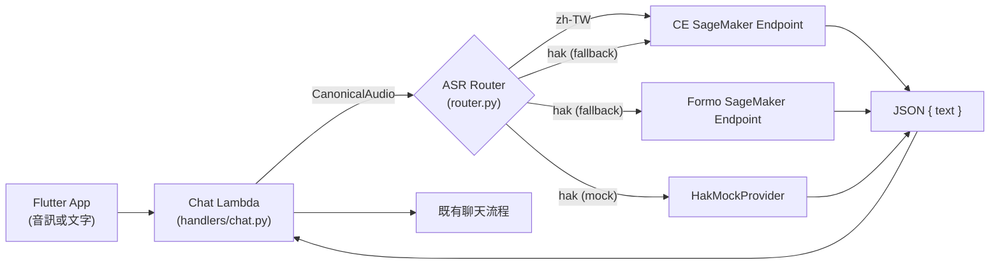

# ASR 子系統架構入口

修改 ASR 之前的第一站。本文件描述設計原則、元件邊界、路由策略、基礎設施概覽與文件導覽。

---

## 文件導覽

| 文件 | 職責 | 什麼時候讀 |
|---|---|---|
| **本文件** (`docs/asr/framework.md`) | 架構層：設計原則、元件邊界、策略概覽 | 任何 ASR 修改之前 |
| [`docs/asr/config-schema.md`](./config-schema.md) | `ASR_CONFIG_JSON` 的完整 JSON schema 與語意 | 設定 ASR 或修改 Terraform 時 |
| [`docs/asr/security-and-pii.md`](./security-and-pii.md) | 安全邊界、PII 禁則、日誌限制 | 碰到音訊、回應或遙測時 |
| [`docs/asr/sagemaker-inference-contract.md`](./sagemaker-inference-contract.md) | Container I/O 契約、health check、錯誤格式 | 實作或修改 inference container 時 |
| [`backend/src/shared/asr/README.md`](../../backend/src/shared/asr/README.md) | 程式碼層：檔案職責、併發實作、測試對應 | 修改 Python 程式碼時 |
| [`docs/adr/asr-remote-only.md`](../adr/asr-remote-only.md) | 決策紀錄：為什麼做這些選擇 | 想了解歷史決策背景時 |
| [`.kiro/skills/developing-ai-elder-care-asr/SKILL.md`](../../.kiro/skills/developing-ai-elder-care-asr/SKILL.md) | AI agent 護欄：精簡指引指向上述文件 | AI agent 修改 ASR 時自動啟用 |

---

## 設計原則與禁則

### Remote-only

Lambda 不可下載、載入或執行 ASR 模型。模型只在 SageMaker Endpoint 執行。
Lambda 只負責將正規化音訊傳送到 SageMaker、驗證 `{ "text": "..." }` 回應，
並將文字交給既有聊天流程。

### Fail-closed

未經核准的路徑一律拒絕且不做任何外呼。預設安全狀態只允許 `hak_mock`；
未完整設定或未核准的遠端路由必須回傳 `route_not_approved`，不可回落到任何模型。

### 唯一設定來源

`ASR_CONFIG_JSON` 是 Lambda 唯一的 ASR 設定來源。不保留分散的 endpoint、裝置、
compute type 或 Formo prompt 環境變數。

### Formo prompt 邊界

Formo 的方言 prompt 固定在 SageMaker endpoint 的 container／部署設定。
Lambda 不傳 prompt ID。尚未選定 prompt 前，Formo endpoint 必須維持未啟用。

---

## 元件邊界圖

### 責任切分

| 元件 | 責任 | 不負責 |
|---|---|---|
| Flutter App | 錄音、base64 編碼、送出 `POST /chat` | 選擇 provider、ASR 設定 |
| Chat Lambda | base64 解碼、時間預算、呼叫 ASR facade、錯誤碼對映 | 模型推論、ASR 設定解析（委給 composition） |
| ASR Facade | 協調各層、發出遙測 | HTTP、認證、DB、session |
| ASR Router | 語言路由、核准判定、建構備援鏈 | 推論、網路呼叫 |
| SageMakerAsrProvider | 組裝 InvokeEndpoint 請求、驗證回應 | 模型推論邏輯 |
| SageMaker Endpoint | 模型推論、回傳 JSON | 路由、核准、遙測 |

---

## 語言路由與 fallback 策略

### 路由表結構

每種語言有一條 `RouteConfig`，指定：

- `provider_identifier`：主 provider
- `fallback_chain`：依序嘗試的備援 provider（tuple）
- `enabled`：是否啟用

### 預設路由（`default_config()`）

| 語言 | 主 provider | 備援 | 預設結果 |
|---|---|---|---|
| `hak` | `hak_mock` | `ce_remote` | mock 回固定文字 |
| `zh-TW` | `ce_remote` | `formo_remote` | `route_not_approved`（未核准） |

### 轉移與終止條件

**會轉移**（容量或可用性問題）：`provider_unavailable`、`provider_failure`、`provider_invalid_response`

**不轉移，立即終止**（非 provider 問題）：`cancelled`、`deadline_exceeded`、`invalid_audio`、`unsupported_audio_format`、`audio_duration_exceeded`、`unsupported_language`、`route_not_approved`

---

## 設定策略概覽

`ASR_CONFIG_JSON` 包含 routes、providers、model_metadata、formo_prompt_id_allowlist 與 concurrency policy。
Terraform 從 endpoint 名稱、allowed providers、routing 和 gates 組裝此 JSON，注入 Lambda 環境變數。

完整 schema 與欄位語意見 [`docs/asr/config-schema.md`](./config-schema.md)。

---

## SageMaker 契約摘要

- 請求 body：raw `audio.pcm_s16le`
- `ContentType`：`application/octet-stream`
- `Accept`：`application/json`
- `CustomAttributes`：`language`、`sample_rate_hz`、`channels`
- 成功回應：`{ "text": "辨識結果" }`
- Lambda 只傳三個 metadata 欄位，不傳 prompt ID、correlation ID 或任何 PII

完整規格見 [`docs/asr/sagemaker-inference-contract.md`](./sagemaker-inference-contract.md)。

---

## 安全與 PII 邊界摘要

- 不可記錄：音訊 bytes、逐字稿、HF token、長者個資、原始 provider 回應
- 遙測 allowlist：只允許 16 個去識別化欄位
- 音訊只在記憶體中存在，不落地到 Lambda `/tmp` 或 DynamoDB

完整規範見 [`docs/asr/security-and-pii.md`](./security-and-pii.md)。

---

## 基礎設施概覽

### Terraform 資源（`terraform/asr_models.tf`）

| 資源 | 用途 |
|---|---|
| IAM Role + Policy | SageMaker 模型執行與 S3 artifact 存取 |
| `aws_sagemaker_model` × 2 | CE 與 Formo 模型定義 |
| `aws_sagemaker_endpoint_configuration` × 2 | 實例類型與初始規模 |
| `aws_sagemaker_endpoint` × 2 | real-time inference endpoints |
| Autoscaling target + policy | target-tracking 自動擴縮 |
| SageMaker invoke IAM policy | Chat Lambda 呼叫 endpoint 的最小權限 |

### `asr_enable_endpoints` 開關

預設 `false`。啟用時必須同時提供：
1. CE image URI
2. CE model-data URL
3. Formo image URI
4. Formo model-data URL
5. Artifact bucket name

缺少任一參數時 validation 失敗，不會建立不完整的 endpoint。

### Lambda 設定注入

Terraform 組裝 `ASR_CONFIG_JSON` 並注入 Chat Lambda 的環境變數。
同時附加 resource-scoped `sagemaker:InvokeEndpoint` IAM policy。

---

## 與系統其他部分的關係

| 系統元件 | 與 ASR 的關係 |
|---|---|
| `docs/framework.md` | 整體架構，ASR 段落指向本文件 |
| `handlers/chat.py` | 唯一呼叫端，透過 `get_asr_facade()` 使用 ASR |
| `docs/api.md` | 公開 API 契約，隱藏內部 provider/endpoint 細節 |
| `docs/pii.md` | 通用 PII 政策，ASR 特有規則在 `security-and-pii.md` |

`docs/api.md` 保持不變：它已隱藏內部 provider／endpoint，且允許裝置端提供的文字，
因此 remote-only 遷移不影響公開 API。
