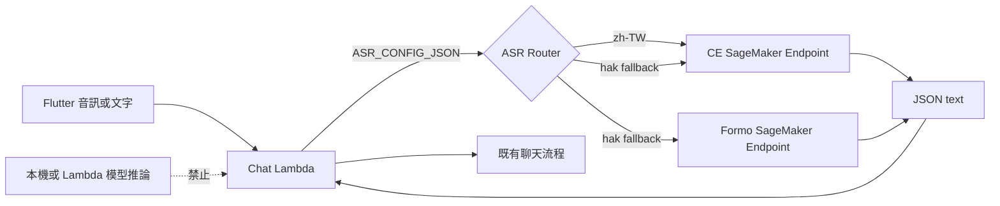

# ASR 僅遠端 AWS 化與交接重整計畫

## 狀態

已完成規劃，待依任務順序實作。此文件是 ASR 遷移的交接入口；架構決策仍記錄於 [`docs/adr/`](../adr/)。

## 問題與範圍

CE 與 Formo Speech 模型必須只在 AWS SageMaker Endpoint 執行。Flutter 與 Python Lambda 都不可下載、載入或執行 ASR 模型；Lambda 只負責將正規化音訊傳送到 SageMaker、驗證 `{ "text": "..." }` 回應，並將文字交給既有聊天流程。

本次不執行 `terraform apply`、不建立實際 AWS endpoint、不傳送真實語音或 PII 至外部服務，也不改變公開 API 契約 `docs/api.md`。

## 已確認決策

- 預設安全狀態僅允許 `hak_mock`；未完整設定或未核准的遠端路由必須回傳 `route_not_approved`，不可回落到本機模型。
- 正式設定可採 `zh-TW → ce_remote`，以及 `hak → ce_remote → formo_remote`；初始明確 fallback 為 `ce_remote`。
- `ASR_CONFIG_JSON` 是 Lambda 唯一的 ASR 設定來源；不保留分散的 endpoint、裝置、compute type 或 Formo prompt 環境變數。
- 移除 Lambda／process 本機模型推論與沒有使用場景的 AWS managed ASR placeholder。
- 保留 `asr-lambda/environment.yml` 與 `asr-model` Conda 環境，定位為模型容器開發與驗證用途，不是 Lambda 模型執行環境。
- Formo 的方言 prompt 固定在 SageMaker endpoint 的 container／部署設定。Lambda 不傳 prompt ID；尚未選定 prompt 前，Formo endpoint 必須維持未啟用。
- Terraform 保留單一 `asr_enable_endpoints` 開關。啟用時必須同時提供兩個模型的 image URI、model-data URL、artifact bucket 與精確的 Formo prompt ID。
- 建立 `.kiro/skills/developing-ai-elder-care-asr/SKILL.md` 作為後續 ASR 維護的專用指引。
- 舊 `.kiro/specs/asr-model-integration/` 在新文件、測試與 skill 完成後刪除，不移至 `tests/`；Git 歷史是舊規格的保存位置。

## 現況稽核摘要

- `docs/framework.md` 同時提及後端 SageMaker ASR 與裝置端 ASR，實作時應統一成後端遠端 ASR。
- `docs/api.md` 已隱藏內部 provider／endpoint，且允許裝置端提供的文字，因此不需改動。
- `handlers/chat.py` 已透過 `get_asr_facade()` 橋接音訊與 ASR；既有 session/idempotency 未完成項目不在本次範圍。
- `local_models.py` 與 `test_local_models.py` 僅供本機模型，可移除；`provider_base.py`、`concurrency.py`、`ModelSlotPool`、`LazyModelHandle` 仍供遠端 provider 使用，必須保留。
- Terraform 尚未提供 inference container、模型 artifact、聊天 Lambda 呼叫 endpoint 的 IAM 權限，或 `ASR_CONFIG_JSON` 注入。

## 目標架構



## SageMaker 對 Lambda 的固定契約

- 請求 body：原始 `audio.pcm_s16le`。
- `ContentType`：`application/octet-stream`。
- `Accept`：`application/json`。
- `CustomAttributes`：`language`、`sample_rate_hz`、`channels`。
- 成功回應：`{ "text": "辨識結果" }`。
- 容器不得將音訊內容、逐字稿、prompt 或原始 provider 回應寫入不安全日誌。
- CE 與 Formo 必須實作相同的 Lambda-facing contract；模型與方言差異只保留於 endpoint container 內。

## 部署前仍需確認的項目

1. CE 模型的 inference container 依賴、model artifact 格式與所需執行資源。
2. Formo 選用的單一客語腔調 prompt：`htia_sixian`、`htia_hailu`、`htia_dapu`、`htia_raoping`、`htia_zhaoan` 或 `htia_nansixian`。
3. AWS 帳號內的 ECR image URI、S3 model-data URL、artifact bucket、執行角色，以及實測成本、延遲與吞吐量。
4. Formo 模型卡的 gated access 與 `CC BY-NC-4.0` 授權限制是否符合實際使用方式。

## 實作任務

### Task 1: 建立遠端 ASR 設定與路由測試基線

**目標：** 先以測試描述只允許 `hak_mock`、`ce_remote`、`formo_remote` 的安全路由行為。

- 擴充 composition、router、fallback 與 property tests。
- endpoint 缺失、gate 關閉、未知 provider、所有 fallback 失敗時，都必須 fail closed。
- 測試必須證明沒有任何情況會呼叫本機推論。
- **Demo：** 無 AWS 設定時只能使用 mock ASR，不會使用模型。

### Task 2: 簡化 provider 型別與設定模型

**目標：** 將 `ASR_CONFIG_JSON` 建立為唯一可用的 Lambda ASR 設定來源。

- 移除 `ProviderKind.LOCAL_MODEL`、`ProviderKind.AWS_MANAGED` 與其 parser/config/router 路徑。
- 定義 JSON schema：allowed providers、routing、endpoint 名稱與 enablement gate。
- 保留遠端 provider 仍使用的 base/concurrency/slot 工具。
- **測試：** 合法與非法 JSON、缺少 endpoint、錯誤路由、fail-closed 行為。
- **Demo：** 一段 JSON 可建立可檢查的 provider registry 與路由表。

### Task 3: 強化 SageMaker 音訊傳輸契約

**目標：** 固定 `RemoteEndpointSpec` 與 `SageMakerAsrProvider` 的安全傳輸與回應驗證。

- 驗證 ContentType、Accept、CustomAttributes、payload、timeout 與 `{ "text": ... }` schema。
- 將 AWS 例外轉換為既有穩定 ASR 錯誤，不記錄音訊或逐字稿。
- **測試：** mock boto3 client 覆蓋成功、回應無效、逾時、endpoint 失敗。
- **Demo：** 單元測試可顯示 Lambda 產生正確 InvokeEndpoint 請求。

### Task 4: 刪除本機與 AWS managed placeholder 推論

**目標：** 徹底移除不符合 remote-only 架構的推論路徑。

- 刪除 `local_models.py`、`test_local_models.py`、`CeLocalProvider`、`FormoLocalProvider` 與 exports。
- 刪除 `AwsZhAdapter`、`AwsCapabilityGate`、`TransportRequest`、AWS managed provider 型別及專屬測試。
- 更新 composition/providers/imports，確保無殘留 fallback 或設定鍵。
- **測試：** ASR 測試集與 import smoke test。
- **Demo：** 程式碼搜尋與測試證明 Lambda 不再有本機模型路徑。

### Task 5: 將聊天 ASR bridge 接到純遠端 facade

**目標：** 維持 chat handler 的責任邊界，僅適配 remote-only provider registry。

- 調整必要 composition 與錯誤處理，不擴張 chat 的 session/idempotency 範圍。
- **測試：** `test_chat_asr_bridge.py` 覆蓋遠端成功、路由未核准與 endpoint 錯誤。
- **Demo：** 模擬 endpoint 回傳文字後，聊天流程可繼續執行。

### Task 6: 文件化 SageMaker inference container contract

**目標：** 新增 `docs/asr/sagemaker-inference-contract.md`。

- 記錄 health/invocation entrypoint、輸入音訊、metadata、成功與錯誤 JSON、逾時與 PII 日誌限制。
- 規定 Formo prompt 必須由 container/deployment 固定，Lambda 不可知道或傳送 prompt ID。
- 建立可重複使用的 contract-test fixture 或最小 smoke-test 規格。
- **Demo：** 未來 container 實作者可依文件建立 Lambda 相容 endpoint。

### Task 7: 建立 SageMaker endpoint Terraform 基礎設施

**目標：** 在 `terraform/asr_models.tf` 與 `variables.tf` 宣告 endpoint 所需資源及 fail-closed validation。

- 新增 image URI、model-data URL、artifact bucket 與 endpoint 資源所需變數。
- 保留單一 `asr_enable_endpoints`；關閉時不建立 CE 或 Formo endpoint。
- 開啟時缺少任一必要參數都必須 validation 失敗。
- **測試：** `terraform fmt -check`、`terraform validate` 與設定範例。
- **Demo：** 不完整 tfvars 安全失敗；完整設定才產生 endpoint plan。

### Task 8: 注入 Lambda 設定並授予最小 IAM 權限

**目標：** 由 Terraform 組裝唯一的 `ASR_CONFIG_JSON`，並只允許 chat Lambda 呼叫預期 endpoint。

- 加入資源範圍限縮的 `sagemaker:InvokeEndpoint` IAM policy。
- 從 Terraform endpoint 名稱、allowed providers、routing 和 gates 組合 `ASR_CONFIG_JSON`。
- 更新 `outputs.tf`，說明 outputs 用於組裝 JSON，不是設定個別 endpoint 環境變數。
- **測試：** Terraform validation 與 Python config contract test。
- **Demo：** 可檢查 Lambda environment 與 IAM policy 的最小權限邊界。

### Task 9: 建立 ASR 文件體系並同步架構文件

**目標：** 建立 `docs/asr/` 完整文件體系，並將專案文件統一為 backend remote ASR 的唯一架構。

#### 新增 ASR 子系統文件

- **`docs/asr/framework.md`**（ASR 架構入口）：
  - 文件導覽（各份 ASR 文件的職責與閱讀順序）
  - 設計原則與禁則（remote-only、fail-closed、唯一設定來源、Formo prompt 邊界）
  - 元件邊界圖（Flutter → Chat Lambda → ASR Router → SageMaker Endpoints，標示責任切分）
  - 語言路由與 fallback 策略（路由表結構、轉移與終止條件、預設安全狀態）
  - 設定策略概覽（ASR_CONFIG_JSON 的角色與 Terraform 組裝方式，指向 config-schema.md）
  - SageMaker 契約摘要（精簡版，指向 sagemaker-inference-contract.md）
  - 安全與 PII 邊界摘要（精簡禁則，指向 security-and-pii.md）
  - 基礎設施概覽（Terraform 資源清單、asr_enable_endpoints 開關、啟用前置條件）
  - 與系統其他部分的關係（與 docs/framework.md、chat handler、docs/api.md 的邊界）

- **`docs/asr/config-schema.md`**（ASR 設定規格）：
  - `ASR_CONFIG_JSON` 的完整 JSON schema
  - 每個欄位的語意、合法值域、預設行為
  - 設定錯誤時的 fail-closed 處理
  - Terraform 如何組裝此 JSON 的對應關係
  - 合法與非法設定範例

- **`docs/asr/security-and-pii.md`**（ASR 安全邊界）：
  - 不可記錄的資料（音訊 bytes、逐字稿、HF token、長者個資、原始 provider 回應）
  - 遙測 allowlist 規則（只允許 16 個去識別化欄位）
  - 音訊生命週期（只在記憶體中存在，不落地到 Lambda /tmp 或 DynamoDB）
  - SageMaker endpoint container 的日誌限制
  - 與 `docs/pii.md` 的關係（ASR 特有規則在此，通用 PII 政策見 pii.md）

#### 同步既有文件

- 更新 `docs/framework.md` 中的 ASR 段落，移除裝置端 ASR 描述，指向 `docs/asr/framework.md`。
- 更新 `backend/src/shared/asr/README.md`，在頂部加入指向 `docs/asr/framework.md` 的導覽。
- 更新 `docs/pii.md`，指向 `docs/asr/security-and-pii.md` 的 ASR 特有規則。
- 更新根目錄 README 與 backend README 導覽。
- 更新 `asr-lambda/README.md`，Conda 環境定位為容器開發用途。
- 新增 `docs/adr/asr-remote-only.md`，記錄 remote-only、fail-closed、移除 AWS placeholder、Formo prompt 固定於部署端的理由。
- `docs/api.md` 保持不變，並在 ADR 與 framework 說明原因。

#### 文件間不重複原則

| 文件 | 職責邊界 |
|---|---|
| `docs/asr/framework.md` | 架構層：設計原則、元件邊界、策略概覽 |
| `docs/asr/config-schema.md` | 設定規格：JSON schema、欄位語意、範例 |
| `docs/asr/security-and-pii.md` | 安全規範：禁則、allowlist、日誌限制 |
| `docs/asr/sagemaker-inference-contract.md` | 容器契約：I/O 格式、health check、錯誤處理 |
| `backend/src/shared/asr/README.md` | 程式碼層：檔案職責、併發實作、測試對應 |
| `docs/adr/asr-remote-only.md` | 決策紀錄：為什麼做這些選擇 |
| `.kiro/skills/.../SKILL.md` | AI agent 護欄：精簡指引指向上述文件 |

- **測試：** 檢查跨文件連結與路徑；每份文件的「指向」目標都存在。
- **Demo：** 維護者從 `docs/asr/framework.md` 出發，可循導覽地圖到達任何 ASR 相關文件，不遺漏也不重複。

### Task 10: 建立 ASR 專用 Kiro skill

**目標：** 建立 `.kiro/skills/developing-ai-elder-care-asr/SKILL.md`。

- 指引後續修改者依序閱讀權威文件、ASR README、endpoint contract、Terraform 與相關測試。
- 明確記錄 remote-only 禁則、`ASR_CONFIG_JSON` 唯一設定來源、Formo prompt 邊界、Terraform 前置條件、文件同步與驗證命令。
- 避免建立與根目錄重複的 skill 副本。
- **測試：** 依 skill checklist 人工走讀，確認每個引用路徑存在。
- **Demo：** 後續 Kiro agent 啟用 skill 後可取得完整 ASR 修改護欄。

### Task 11: 以新交接資料取代舊 spec

**目標：** 在所有現行文件、測試、contract 與 skill 完成後，移除舊規格。

- 刪除 `.kiro/specs/asr-model-integration/`。
- 不將舊規格移進 `tests/`，避免過時規劃被誤認為可執行測試或當前事實。
- 搜尋並移除所有指向舊 spec 的連結。
- **Demo：** 交接依現行程式、測試、ADR、contract、skill 與 Git history 完成。

### Task 12: 驗證與交接 smoke test

**目標：** 在不部署 AWS 資源的條件下，驗證程式、Terraform 與文件的一致性。

```powershell
conda activate asr-model
cd backend
python -m pip install -e ".[dev]"
python -m pytest tests/asr -q
python -m pytest tests/test_chat_asr_bridge.py -q

cd ../terraform
terraform fmt -check
terraform validate
```

- 不執行 `terraform apply`，也不將真實語音或 PII 傳至外部服務。
- **Demo：** 測試、設定驗證與文件導覽均成功；部署者可安全準備參數而不會在設定不完整時誤啟用 endpoint。

## 文件分類決定

### `docs/asr/` 目錄結構

```text
docs/asr/
├── framework.md                      ← ASR 子系統架構入口（設計原則、元件邊界、路由策略、基礎設施概覽、文件導覽）
├── config-schema.md                  ← ASR_CONFIG_JSON 完整 schema 與語意規格
├── security-and-pii.md               ← ASR 安全邊界、PII 禁則、日誌限制
├── sagemaker-inference-contract.md   ← SageMaker inference container 的 Lambda-facing 契約
└── remote-only-migration-plan.md     ← 本遷移計畫（完成後標記歸檔）
```

### 各文件職責與讀者

| 文件 | 職責 | 主要讀者 |
|---|---|---|
| `docs/asr/framework.md` | 修改 ASR 之前的第一站：設計原則、禁則、元件邊界、路由策略、設定概覽、安全摘要、基礎設施概覽、文件導覽 | 任何 ASR 修改者 |
| `docs/asr/config-schema.md` | `ASR_CONFIG_JSON` 的完整 JSON schema、欄位語意、合法值、錯誤處理、Terraform 對應 | 設定 ASR 的人、Terraform 修改者 |
| `docs/asr/security-and-pii.md` | 不可 log/傳/存的資料清單、遙測 allowlist、音訊生命週期、container 日誌限制 | 碰到音訊或回應的人 |
| `docs/asr/sagemaker-inference-contract.md` | Container I/O 契約、health check、錯誤格式、timeout、Formo prompt 邊界 | Container 實作者 |
| `docs/asr/remote-only-migration-plan.md` | 一次性遷移任務追蹤 | 完成後標記歸檔 |

### 與其他位置的分工

- `backend/src/shared/asr/README.md`：程式碼模組的現況紀錄（檔案職責、併發實作、測試對應）。打開程式碼目錄時的指引，不重複架構層內容，頂部指向 `docs/asr/framework.md`。
- `docs/adr/asr-remote-only.md`：架構決策紀錄（為什麼選擇 remote-only），放在專案級 `docs/adr/`，不移入 `docs/asr/`。
- `docs/adr/asr-model-validation-template.md`：模型驗證 ADR 模板，維持在 `docs/adr/`。
- `.kiro/skills/developing-ai-elder-care-asr/SKILL.md`：AI agent 的精簡護欄，指向上述人類文件，不重複內容。
- `asr-lambda/docs/`：模型卡（CE、Formo），定位為容器開發參考資料。
