我讀了 `aws-hackathon/src` 的完整 pipeline（`end_to_end_pipeline` → `chunker` → `rac_pipeline`／`dense_retriever`／`rac_classifier`／`hmlc_pruner`／`dynamic_schema_composer` → `structured_extractor` → `temporal_resolver` → `storage`）與 `models/` 的本體論資產，也對照了 `ai-elder-care` 現況（`backend/src/shared/db.py`、`handlers/*.py`、`terraform/*.tf`、`docs/framework.md`、`docs/api.md`、`docs/conventions.md`）。

先講結論：**`events` 表的 schema 層面沒有重大衝突**，DynamoDB 表結構與 GSI 一行都不用改。真正的衝突集中在三處——分類體系的語意落地（UCO 49 節點 vs 六類 `type`）、向量檢索在架構圖上沒有節點、以及「batch 萃取到疑似 routine 完成」撞到 framework 明文禁止的 batch 寫 routine。這三點我列在第 4 節並在最後提問，沒有動任何規範文件。

---

## 1. 差異與相容性分析

### 兩邊 pipeline 的定位差異

| 面向 | aws-hackathon（PoC） | ai-elder-care（framework.md） |
|---|---|---|
| 輸入 | 整段 raw dialogue（str 或 list） | closed session 的 frozen ordered turns（`conversations` Base table 強一致讀） |
| 執行環境 | 本機腳本、Gemini API／本地 GGUF、`outlines`、`sentence-transformers`+`torch` | Python 3.11 Lambda、Bedrock、僅 `boto3`+`pydantic` |
| 事件身分 | `rec_{chunk_id}_{timestamp}_{idx}`＋`event_index`（chunk 與時間戳決定身分） | `evt_<stable-hash(elder_id + canonical_event_key)>`，canonical key = `Date + Slot + Subject + Predicate`，**與 chunk 無關** |
| 冪等 | 無（重跑產生新記錄） | 必要（conditional Put、lease、SQS at-least-once、DLQ replay） |
| 去重 | 無 | 記憶體內去重（`EVENT_SLOT_MINUTES`，預設 30 分） |
| 時間 | naive `datetime.now()` | `+08:00`、固定毫秒、`ts` 正規化後組 `event_time_key` |
| 分類體系 | UCO 49 節點（3 層、HMLC 剪枝） | `events.type` 六類；`rt_labels` 只允許 `routine`/`safety_alert`/`none` |
| 分軌 | 單軌，一次做完全部萃取 | realtime（routine + 高風險 safety）／batch（一般事件 + safety enrichment），ownership 不得混用 |
| 落地 | JSON/JSONL + SQLite | DynamoDB `events` conditional Put + revision enrichment |

### 模組對應與處置

| aws-hackathon 模組 | ai-elder-care 對應 | 處置 |
|---|---|---|
| `parse_raw_dialogue` | frozen turns → chunk text | **改寫**：輸入源改成 `turn_ids` 的 `ConsistentRead` BatchGet，speaker 由 `ai_prompt_text`／`elder_transcript` 組裝 |
| `chunker.*`（boundary 演算法） | batch extractor 的 chunk planner + `chunk_manifest` | **保留演算法、改寫輸出**：boundaries 轉成 core ranges + ordinal + `chunk_id=stable-hash(session_snapshot_hash+first+last+ordinal)`，首次以 `attribute_not_exists` 條件持久化 |
| `hmlc_pruner` | 不變 | **可近乎原樣移植**（純 Python + ontology JSON，最容易先寫測試的一塊） |
| `dynamic_schema_composer` | 產生 `structured_detail` 的動態 schema | **原樣移植**，輸出對映 `events.structured_detail`；`prune_irrelevant_event_properties` 保留（防跨類別屬性污染） |
| `rac_classifier` | 多標籤分類 | **換 client**：Gemini/outlines → Bedrock structured output；prompt 與 HMLC 決策邏輯保留 |
| `structured_extractor.extract_single_pass` | batch extraction | **換 client + 擴充輸出**：events 陣列需新增 `subject`／`predicate`，否則算不出 canonical key |
| `temporal_resolver` | `ts` 正規化 | **改寫**：加 `+08:00`／毫秒；`reference_datetime` 必須取自 turn 的 `created_at`，**不可用 `datetime.now()`**（否則 retry 不冪等，直接違反 framework 的去重確定性要求） |
| `dense_retriever`（bge-m3 + torch） | 候選標籤檢索 | **不可直接移植**（torch 進不了 250 MB Lambda 包）→ 見第 4 節 B |
| `event_disaggregator`（two-stage） | 可選 | MVP 走 `single_pass`，two-stage 以 config 保留 |
| `storage`（JSON/SQLite） | `shared/db.py` | **不移植** |
| `evaluation/`、`run_*.py`、`*.gguf`、`pairwise_segmenter_model.pkl` | — | **不移植**（留在 hackathon 做離線評測） |
| — | canonical key／slot 去重／revision／SQS lease／DLQ | **新增**（framework 特有，hackathon 完全沒有） |

### 關鍵接縫：細粒度分裂 vs canonical 合併

hackathon 的設計方向是**盡量分裂**（同標籤不同實體／不同時間各自成事件，保住「血壓 135/85」這種細節）；framework 的方向是**依 slot 合併**（同 Subject+Predicate 在 30 分鐘內收斂成一筆）。兩者不矛盾，可串接：

```mermaid
flowchart LR
    turns["frozen turns"] --> plan["chunk planner<br/>core ranges + manifest"]
    plan --> cls["RAC 多標籤分類<br/>Bedrock structured output"]
    cls --> prune["HMLC 剪枝"]
    prune --> compose["動態 schema 組裝"]
    compose --> ext["single-pass 萃取<br/>events[] + subject/predicate"]
    ext --> temp["temporal：+08:00 / ms<br/>ref = turn.created_at"]
    temp --> canon["canonical key<br/>Date+Slot+Subject+Predicate"]
    canon --> dedup["記憶體內去重<br/>EVENT_SLOT_MINUTES"]
    dedup --> put["conditional Put → events"]
```



先分裂保細節、再依 canonical key 合併保冪等。`detail` 取最完整的一次、`structured_detail` 取最完整、`evidence_conversation_ids` 取聯集——這正是 framework「合併規則」那段的要求。

### 兩個容易踩到的實作細節

- **DynamoDB 不吃 `float`**：hackathon 的動態 schema 大量使用 `float`（`confidence_score`、血壓數值），boto3 resource 寫入前必須轉 `Decimal`。
- **動態 schema 會產生大量 `None` 欄位**：Universal Ancestral Traversal 把所有祖先屬性都攤平，未提及即為 null。寫入前應剔除 `None`，否則 item 膨脹、逼近 400 KB 上限。

---

## 2. `events` 表實作計畫

### 表結構變動：無

`terraform/dynamodb.tf` 的 `events`（PK `elder_id` + SK `event_id`、GSI `events-by-time` Projection ALL、PITR）已完全符合 framework，DynamoDB 又是 schemaless，**不需要任何 Migration DDL**。

### 欄位對照（pipeline 輸出 → `events`）

| pipeline 輸出 | `events` 欄位 | 轉換規則 |
|---|---|---|
| `event_summary` | `detail` | 直接對應；不複製逐字稿 |
| `concept_id` | `structured_detail.concept_id` + 決定 `type` | 經 server-owned 映射表轉六類（見第 4 節 A） |
| leaf／category／global 屬性 | `structured_detail.*` | 剔除 `None`、`float`→`Decimal` |
| `observed_at` | `ts` | `+08:00`、毫秒；ref 用 turn `created_at` |
| `confidence_score`／`UCOLabelHit.confidence` | `confidence` | 取 `min(分類, 萃取)`，另一個留在 `structured_detail` |
| `chunk_id` | `source_chunk_id` | 只記初建來源 |
| — | `canonical_event_key` | `Date + Slot + Subject + Predicate`（新增 subject／predicate 輸出） |
| — | `event_id` / `event_time_key` | `evt_<stable-hash(elder_id+canonical_key)>` / `<ts>#<event_id>` |
| — | `extraction_track` | 固定 `batch` |
| — | `source` | 固定 `conversation` |
| — | `session_id`／`evidence_conversation_ids` | 由 chunk core range 的 turn IDs 推導 |
| — | `revision`／`schema_version` | 初始 `1` |
| — | `created_at`／`updated_at` | `+08:00` 毫秒 |
| `context_snippet`／`evidence_span`／`rationale` | **不落地** | PII 最小化（見第 4 節 C） |

必填欄位全部可從 pipeline 輸出 + wrapper 補齊，**沒有型態或必填衝突**。

### `shared/db.py` 需修正的既有缺陷

現行實作與 framework 有落差，這是「修正實作」不是「改規範」：

| 現況 | 問題 | 修正 |
|---|---|---|
| `create_event` 用 `put_item` | 無條件覆寫，違反「不得靜默覆寫」 | conditional Put `attribute_not_exists(event_id)`；命中相同 canonical 視為冪等，內容互斥則保留既有、告警並讓工作失敗 |
| `create_event` 允許無 `canonical_event_key` 時退回 `uuid4` | 破壞冪等 | canonical key 必填 |
| `data["ts"]` 未正規化 | 排序鍵精度不一致 | 統一 `+08:00` 毫秒後才組 `event_time_key` |
| `list_events` 對 Base table 用 `ts BETWEEN` | Base table SK 是 `event_id`，此查詢無法成立 | 改 Query GSI `events-by-time`、`ScanIndexForward=False`、`to` 邊界 `23:59:59.999+08:00`、`type` 走 FilterExpression |
| `complete_routine_with_event` | 無 canonical key、無條件式、缺 `routine_date`／`routine_version`／`completed_by` | 依 `elder_id+routine_id+routine_date` 產 canonical key，條件式寫入 |
| 缺 enrichment | 無法做 safety event revision enrich | 新增 `enrich_event()`：以 `event_id` + 現行 `revision` 為條件遞增 |

### 資料 Migration

沒有 production 資料，不需 backfill。但 dev／測試環境若已用舊 `create_event` 寫過 event，canonical 規則改變後 `event_id` 規則不一致——**清空 dev `events` 表是破壞性操作，我不會自己動，列入第 4 節 E 等你確認**。

---

## 3. Module B 移植步驟

### 檔案清單

```
backend/src/
├── extraction/                    ← 新增（pipeline 核心）
│   ├── __init__.py
│   ├── models.py                  移植 data_models（精簡：DialogueChunk / LabelHit / ExtractedEvent）
│   ├── config.py                  ExtractionConfig，env 驅動（EVENT_SLOT_MINUTES 等）
│   ├── ontology.py                載入本體論 + concept_id→type 映射
│   ├── pruner.py                  移植 hmlc_pruner
│   ├── schema_composer.py         移植 dynamic_schema_composer
│   ├── retriever.py               候選標籤檢索（方案依 Q1 決定）
│   ├── classifier.py              移植 rac_classifier（改 Bedrock）
│   ├── extractor.py               移植 structured_extractor（single-pass）
│   ├── temporal.py                改寫 temporal_resolver（+08:00 / ms）
│   ├── canonical.py               新增：slot / subject / predicate / canonical_event_key
│   ├── dedup.py                   新增：記憶體內去重
│   ├── chunk_planner.py           新增：core ranges + chunk_manifest + chunk_id
│   ├── pipeline.py                對應 end_to_end_pipeline 的編排
│   └── assets/ontology/           unified_care_ontology.json、property_registry.json（+ 預算向量，視 Q1）
├── handlers/
│   ├── batch_extractor.py         新增（SQS consumer）
│   ├── session_closer.py          新增（close endpoint + EventBridge sweep）
│   ├── dlq_reconciler.py          新增
│   └── events.py                  修改（GET /events）
└── shared/
    ├── bedrock.py                 新增（LLM/embedding client、retry、版本常數）
    ├── db.py                      修改（events 條件式寫入／enrich／GSI 查詢、session batch 狀態）
    └── models.py                  修改（events / session batch 欄位模型）
terraform/
├── sqs.tf                         新增（batch queue + DLQ + redrive）
├── lambda.tf                      修改（三個新 Lambda、IAM、打包）
└── eventbridge.tf                 修改（idle close sweep、BATCH#PENDING recovery sweep）
```

### 任務順序（每步都有可 demo 的增量）

**Task 1：extraction 套件骨架與純邏輯移植**
移入 ontology 資產，移植 `hmlc_pruner` 與 `models`，新增 `ontology.py` 的 concept_id→六類映射。
測試：祖先鏈、葉節點壓制父節點、父節點退守保留、49 節點全部有 type 映射且無遺漏。
Demo：輸入一組命中 concept_id，輸出剪枝後標籤與對應六類 `type`。

**Task 2：時間與 canonical identity**
`temporal.py`（`+08:00`、毫秒、ref 取 turn `created_at`）、`canonical.py`（slot 計算、subject/predicate 正規化、canonical key、`event_id`、`event_time_key`）。
測試：slot 邊界（09:29／09:30）、`EVENT_SLOT_MINUTES=60` 的 `SLOT_09` 格式、相對時間跨台灣日界、同輸入產生同 `event_id`、routine completion canonical key 不含 `routine_version`。
Demo：「昨天晚上吃了血壓藥」+ reference → `ts` / canonical key / `event_id`。

**Task 3：`events` 資料層與 `GET /events`**
按第 2 節修正 `db.py`，實作 `events.py` handler。
測試：conditional Put 冪等、互斥內容衝突拋錯、`enrich_event` revision 遞增、日期邊界 `23:59:59.999`、`next_token` 跨頁穩定、`Decimal` 轉換。
Demo：seed 幾筆事件 → `GET /events?elder_id=&from=&to=&type=` 回傳正確時間軸，且回應不含 canonical key／track／revision／`structured_detail`。

**Task 4：Bedrock client 與分類＋萃取**
`shared/bedrock.py`、`classifier.py`、`schema_composer.py`、`extractor.py`、`retriever.py`。single-pass prompt 擴充 `subject`／`predicate`。
測試：以錄製 fixture 驗證 prompt 組裝、動態 schema 組裝與跨類別屬性清洗、JSON 解析容錯、失敗分類（retryable vs permanent validation）。
Demo：對 `data/scenarios` 的固定 transcript 跑分類＋萃取，印出 events 陣列（含 type／subject／predicate／structured_detail），不寫 DB。

**Task 5：chunk planner 與 manifest**
core ranges partition 驗證、bounded context overlap、`chunk_id` stable hash、manifest 首次條件式持久化。
測試：core ranges 完整不重疊且每 turn 恰好一次、context-only turn 不 emit、retry／duplicate／DLQ replay 重用同一 manifest、LLM 回傳非法 boundaries 時安全 fallback。
Demo：12 turns 的 frozen session → manifest 與 chunk IDs；重跑輸出完全相同。

**Task 6：記憶體內去重與 pipeline 編排**
`dedup.py` + `pipeline.py`。
測試：30 分鐘內同 Subject+Predicate 合併為一筆、跨 slot 不合併、`detail`／`structured_detail` 取最完整、evidence 聯集、同 snapshot 兩次跑產出相同 canonical key 集合。
Demo：含重複提及的 transcript → 去重後事件清單 + 合併軌跡。

**Task 7：batch extractor Lambda**
`pending→processing` lease、duplicate ack 規則、conditional Put 寫 events、turn 的 `batch_*` 欄位更新、completed 清 GSI 欄位、permanent 設 `failed`／retryable throw。
測試：lease-expired 接管、lease 有效的 duplicate 不執行直接 ack、`failed` 不得 claim、events 寫入冪等。
Demo：投遞一則 SQS fixture → `events` 出現事件、session `batch_status=completed` 且 batch GSI 欄位移除。

**Task 8：session closer、DLQ 與 IaC 串接**
`session_closer.py`、`dlq_reconciler.py`、`sqs.tf`／`lambda.tf`／`eventbridge.tf`／IAM。
測試：inflight 回 409 `REQUEST_IN_PROGRESS`、lease-expired turn 接管或安全 terminal failure、canonical serialization 的 snapshot hash、closed 後不可追加、DLQ hash 不符不得誤改 session。
Demo：`POST /chat/sessions/{session_id}/close` → closed → SQS → batch → 照護者端 `GET /events` 看到一般生活事件（Module B 端到端）。

**Task 9：文件同步與觀測**
`framework.md` Repo 結構補 `extraction/assets`（若 Q1 選需要檢索節點的方案，架構圖也要補）；`api.md` 預設不動；補 CloudWatch 指標：chunk 數、batch attempts、去重合併率、type 分佈、structured output 失敗率。
Demo：文件 diff + 指標清單。

---

## 4. 待討論衝突點

**A. UCO 49 節點 vs `events.type` 六類（分類語意）**
不是 schema 不相容——`type` 仍寫六類、`concept_id` 藏進 `structured_detail`（API 不暴露）。但三個映射我不想擅自決定：`InterpersonalSocialBehavior`（家屬互動／看電視／社區休閒）歸 `activity` 還是 `other`？`PhysiologicalMeasurement`（血壓量測）歸 `wellbeing` 還是 `other`？`SafetyIncident`（跌倒／走失／詐騙）歸 `wellbeing` 還是 `other`——六類裡沒有 safety 類。若你希望照護者端看得到 UCO 細分類，就得改 `api.md`／`framework.md` 暴露新欄位。

**B. 向量檢索（RAC）在架構圖上沒有節點** — 架構原則衝突
`sentence-transformers`+`torch` 進不了 Lambda。三個選項：(a) 離線預算 49 節點向量打包，query embedding 走 Bedrock Titan Embed；(b) 放棄檢索，改 hackathon 已有的 `NO_RAC_DIRECT`（全量標籤塞 prompt，token 較高但零資產、少一次呼叫）；(c) 用 Bedrock KB 當檢索器（但 KB 目前定位是衛教文件，混用會污染用途）。framework 架構圖裡 batch extractor 只連 model 與 ddb，**選 (a) 或 (c) 就必須更新架構圖**，所以先問你。

**C. batch 萃取到疑似 routine 完成** — 資料流／架構原則衝突
framework 明文「batch 不得建立、修改、停用或完成 routine」。但 pipeline 很可能從 closed session 萃出「早上吃了血壓藥」——若 realtime rail 當時沒抓到，batch 只能寫一筆一般 `medication` 事件，結果同一件事在 UI 上會呈現為「routine 仍 pending/missed」＋「一筆 medication 事件」的語意重複。可能作法：(i) 照規範不動，接受重複（realtime 漏抓就是漏抓）；(ii) batch 偵測到疑似 completion 時只寫一般事件並在 `structured_detail` 標記 `suspected_routine_id`，供摘要層降噪，仍不寫 completion event；(iii) 修改規範開放 batch 寫 completion event（破壞兩軌 ownership，我不建議）。

**D. evidence／audit 欄位**（我的預設，可覆蓋）
`context_snippet`／`evidence_span`／`rationale` 不落地，只存 `evidence_conversation_ids`，符合 PII 最小化與「不複製逐字稿」。要做 hackathon 那種離線品質評測時，另跑離線腳本讀 `conversations`。

**E. dev `events` 表既有測試資料**（需你同意才執行）
canonical 規則變更後舊 `event_id` 規則不一致。建議清空 dev 表——這是破壞性操作，我不會自行執行。

**F. 萃取模式**（我的預設）
MVP 用 `single_pass`（一次呼叫完成分裂＋屬性＋時序，成本與延遲較好），`two_stage` 以 config 保留不刪。

---

## 5. 其他分析

**realtime rail 不要碰這條 pipeline。** framework 明文 realtime「不為每個 turn 另呼叫一次完整 extraction LLM」。整條 RAC pipeline 只放 batch extractor；`/chat` 維持既有 chat structured output + deterministic safety rules。這點兩邊相容，但很容易在實作時手滑把 pipeline 塞進 `/chat`，值得在 code review 時盯著。

**測試策略。** Task 1、2、5、6 是純函式（剪枝、時間、canonical key、chunk 規劃、去重），可以完全離線用 pytest 覆蓋，也是整條 pipeline 冪等性的根基，優先寫。Task 3、7、8 涉及條件式寫入與 transaction，需要 moto 或 LocalStack；framework 的 Verification 章節已列出對應案例，測試名稱直接對齊那些條目最省事。

**Module B 目前的實作缺口比移植本身大。** `chat.py`、`events.py` 都還是 `not_implemented()`，`session_closer`／`batch_extractor`／SQS／DLQ／EventBridge 完全不存在。也就是說：這次工作大約 30% 是移植 hackathon 的萃取邏輯，70% 是補齊 framework 要求的 session 生命週期、冪等與可靠性骨架。Task 排序刻意讓萃取邏輯（1、2、4、5、6）先能離線 demo，再接上基礎設施（3、7、8），避免一開始就卡在 AWS 環境。

**hackathon 的評測資產別丟。** `eval_report_*.md` 與 `PoC_evaluation_report_v2.md` 記錄了 prompt scope、turn length、Stage 1 必要性等調校結論，移植 prompt 時應沿用那些結論（尤其「Stage 2 必須傳入 patient context」——對應到這邊就是萃取 prompt 要帶 `elders` 的 persona／`health_notes`）。

---

我是 planning agent，只讀不寫，上面沒有任何檔案被修改。要繼續之前，先確認三個影響架構與契約的決策：

```
[1]: UCO concept_id 與六類 type 的落地方式？
a. **只藏後端** - concept_id 進 structured_detail，API 不暴露；InterpersonalSocialBehavior→activity、PhysiologicalMeasurement→wellbeing、SafetyIncident→wellbeing（我的預設）
b. **只藏後端但映射不同** - 同上但 PhysiologicalMeasurement / SafetyIncident 歸 other
c. **對外暴露細分類** - 需同步修改 api.md 與 framework.md 新增欄位
d. Other - 提供你的映射

[2]: RAC 向量檢索採哪個方案？
a. **離線預算向量 + Bedrock Titan Embed** - 保留檢索品質，需更新 framework.md 架構圖加 embedding 節點
b. **NO_RAC_DIRECT** - 全量標籤塞 prompt，架構圖不用改、無額外資產，token 成本較高
c. **Bedrock KB 當檢索器** - 重用既有元件，但與衛教文件用途混雜
d. Other

[3]: batch 萃取到疑似 routine 完成時怎麼處理？
a. **照規範不動** - 只寫一般事件，接受與 pending/missed occurrence 的語意重複
b. **標記但不寫 completion** - structured_detail 記 suspected_routine_id，供摘要層降噪（我的建議）
c. **修改規範** - 開放 batch 寫 completion event（破壞兩軌 ownership）
d. Other
```

（可以只回答部分，例如「1=a, 2=b, 3=b」；D、E、F 我已給預設，要改也一併說。）這份計畫看起來可以嗎，還是有想調整的地方？