# 生活記錄（Module B）事件萃取移植計畫

把 `aws-hackathon` 的 UCO 端到端萃取 pipeline 移植到本專案的生活記錄（Module B）與 `events` 表。權威規範以 [framework.md](framework.md) 為最高原則，API 契約以 [api.md](api.md) 為準；本文件只描述移植決策與步驟，不覆寫上述兩份規範。

## 0. 工作方式

分支 `feature/events-extraction`，從最新 `main` 開出。每個 Task 結束依 [workflow.md](workflow.md) 做 Conventional Commit（`<type>(<scope>): <subject>`，英文祈使句，一個 commit 只做一件事）。commit 前跑該區域檢查：後端 `python -m pytest`、Terraform `terraform fmt`。未經指示不 push、不開 PR。

思考推理與實作時使用 `.kiro/skills`：

| Skill | 用在 |
|---|---|
| `developing-ai-elder-care` | 全程；權威文件、命名與註解慣例、git 規則 |
| `amazon-dynamodb` | Task 5／11／12：條件式寫入、GSI、transaction |
| `aws-sdk-python-usage` | 所有 boto3 程式 |
| `storing-and-querying-vectors` | Task 7：S3 Vectors 概念索引 |
| `aws-serverless` | Task 11／12：SQS event source、DLQ、冪等、concurrency |
| `connecting-lambda-to-dynamodb` | Task 11／12：IAM 最小權限 |
| `connecting-lambda-to-api-gateway` | Task 5／12 |
| `securing-s3-buckets` | Task 7：資產與向量桶 |
| `signing-in-to-aws` | 需實機驗證前取憑證 |
| `debugging-lambda-timeouts`、`troubleshooting-application-failures` | 部署後除錯 |
| `git-commit` | 每個 Task 結束 |

## 1. 決策紀錄

| # | 決策 |
|---|---|
| A | `events.type` 維持高階類別供前端使用；新增 `concept_id`（UCO 節點）與 `taxonomy_version` 供後端篩選統計，`GET /events` 不暴露 |
| A-1 | `InterpersonalSocialBehavior` → `other`（`activity` 需有身體動作）；`PhysiologicalMeasurement` → `wellbeing` |
| A-2 | 新增 `safety` 第七高階類，連動 `daily_summaries.sections` 與 `api.md` |
| A-3 | 高階類別與 UCO 節點體系皆可配置、可擴充、可抽換；以目前定義先行實作 |
| B | 概念檢索走 S3 Vectors + Bedrock Embedding；模型（Titan Text Embeddings V2 vs Cohere Embed Multilingual v3）比賽當天小規模比對後定案，程式以介面與 env 抽換 |
| C | batch 萃取到疑似 routine 完成時只寫一般事件，`structured_detail` 標 `suspected_routine_id`，不寫 completion event |
| D | `context_snippet`／`evidence_span`／`rationale` 不落地，只存 `evidence_conversation_ids` |
| E | 無既有 events 資料（`data/seed.py` 未實作、handlers 皆 `not_implemented`），不需 migration 或清表 |
| F | 萃取走 `single_pass`；`two_stage` 以 config 保留 |
| G | 分塊器兩模式都進 MVP：`embedding_depth`（先行、無訓練依賴）與 `pairwise_v2`（有監督，帶上線 gate）；不移植任何 `.pkl`。離線訓練與評測工作流見 [feature_segmenter-pairwise-v2.md](feature_segmenter-pairwise-v2.md) |
| H | 萃取階段用 prompt 承載動態 schema 規則 + Pydantic 後驗證；分類與分塊用 Bedrock structured outputs |
| I | 單一事件驗證失敗 → 丟棄該事件 + 計數告警，chunk 其餘照寫 |
| J | 上游（`aws-hackathon`）的修補與評測補齊納入待辦，commit 進該 repo |

## 2. 差異與相容性分析

### 定位差異

| 面向 | aws-hackathon（PoC） | 本專案（framework.md） |
|---|---|---|
| 輸入 | 整段 raw dialogue（str 或 list） | closed session 的 frozen ordered turns（Base table 強一致讀） |
| 執行環境 | 本機腳本、Gemini API／本地 GGUF、`outlines`、`sentence-transformers`+`torch` | Python 3.11 Lambda、Bedrock |
| 事件身分 | `rec_{chunk_id}_{ts}_{idx}` + `event_index`（chunk 與時間戳決定身分） | `evt_<stable-hash(elder_id + canonical_event_key)>`，與 chunk 無關 |
| 冪等 | 無（重跑產生新記錄） | 必要（conditional Put、lease、SQS at-least-once、DLQ replay） |
| 去重 | 無（storage 層 MD5） | 記憶體內去重（`EVENT_SLOT_MINUTES`，預設 30 分） |
| 時間 | naive `datetime.now()` | `+08:00`、固定毫秒；`ts` 正規化後才組 `event_time_key` |
| 分類 | UCO 49 節點 / 147 sub-chunks | 高階七類 `type` + `concept_id` |
| 分軌 | 單軌，一次做完全部萃取 | realtime（routine + 高風險 safety）／batch（一般事件 + safety enrichment），ownership 不得混用 |
| 落地 | JSON/JSONL + SQLite | DynamoDB `events` conditional Put + revision enrichment |

### 模組對應與處置

| aws-hackathon 模組 | 處置 |
|---|---|
| `parse_raw_dialogue` | 改寫：輸入源改成 `turn_ids` 的 `ConsistentRead` BatchGet，speaker 由 `ai_prompt_text`／`elder_transcript` 組裝 |
| `hmlc_pruner` | 近乎原樣移植（純邏輯 + ontology JSON，最先寫測試） |
| `dynamic_schema_composer` | 移植；輸出對映 `structured_detail`；保留 `prune_irrelevant_event_properties` |
| `rac_classifier` | 換 Bedrock structured outputs（固定 schema）；保留 Multi-Shot 與 Top-K=14 |
| `dense_retriever` | 改寫：`sentence-transformers`／`torch` 不進 Lambda；索引移 S3 Vectors，query embedding 走 Bedrock；保留「每 concept 取 sub-chunk 最大相似度」聚合 |
| `structured_extractor.extract_single_pass` | 移植 prompt；輸出新增 `subject`／`predicate`；帶入 elder persona 與 `health_notes` |
| `chunker`（Refined EST prompt） | 移植 prompt，輸出改 core ranges |
| `chunker`（TF-IDF／MiniLM pairwise `.pkl`） | 不移植，理由見 §6 |
| `temporal_resolver` | 改寫：`+08:00`／毫秒；`reference_datetime` 取自 turn 的 `created_at`，不可用 `datetime.now()`（否則 retry 不冪等） |
| `event_disaggregator` | 保留為 `two_stage` 選項，MVP 不走 |
| `storage`（JSON/SQLite） | 不移植，落地改 `shared/db.py` |
| `evaluation/`、`run_*.py`、`*.gguf` | 不移植，留在 hackathon 做離線評測 |
| — | canonical key／slot 去重／revision／SQS lease／DLQ：framework 特有，全新實作 |

### 關鍵接縫：細粒度分裂 vs canonical 合併

hackathon 方向是盡量分裂（保住「血壓 135/85」這種細節），framework 方向是依 slot 合併（保冪等）。兩者不矛盾，可串接：先分裂保細節、再依 canonical key 合併保冪等；`detail` 與 `structured_detail` 取最完整的一次，`evidence_conversation_ids` 取聯集。

```mermaid
flowchart LR
    turns["frozen turns"] --> plan["chunk planner<br/>core ranges + manifest"]
    plan --> ret["概念檢索<br/>S3 Vectors + Bedrock Embedding"]
    ret --> cls["RAC 多標籤分類<br/>structured outputs"]
    cls --> prune["HMLC 剪枝"]
    prune --> compose["動態 schema 組裝"]
    compose --> ext["single-pass 萃取<br/>events[] + subject/predicate"]
    ext --> temp["temporal：+08:00 / 毫秒<br/>ref = turn.created_at"]
    temp --> canon["canonical key<br/>Date + Slot + Subject + Predicate"]
    canon --> dedup["記憶體內 slot 去重"]
    dedup --> put["conditional Put → events"]
```



### 兩個容易踩到的實作細節

- **DynamoDB 不吃 `float`**：動態 schema 大量使用 float（`confidence_score`、血壓數值），boto3 resource 寫入前必須轉 `Decimal`。
- **動態 schema 會攤平所有祖先屬性**，未提及即為 `None`；寫入前剔除 `None`，避免 item 膨脹逼近 400 KB 上限。

## 3. `events` 表實作計畫

### 表結構變動：無

`terraform/dynamodb.tf` 的 `events`（PK `elder_id` + SK `event_id`、GSI `events-by-time` Projection `ALL`、PITR）已符合規範，DynamoDB schemaless，不需要 DDL 或 backfill。

### 新增欄位

| 欄位 | 型別 | 必填 | 說明 |
|---|---|---|---|
| `concept_id` | String | 自動萃取事件必填 | UCO 節點分類，如 `UCO.BehavioralRecord.MedicationBehavior.ScheduledMedication`；API 不暴露 |
| `taxonomy_version` | String | 自動萃取事件必填 | 寫入當時的分類體系版本，如 `uco-1.0.0`；抽換體系後舊事件保留原值 |

### 欄位對照（pipeline 輸出 → `events`）

| pipeline 輸出 | `events` 欄位 | 轉換規則 |
|---|---|---|
| `event_summary` | `detail` | 直接對應；不複製逐字稿 |
| `concept_id` | `concept_id` + 決定 `type` | 經 `concept_type_map.json` 映射到高階類別 |
| leaf／category／global 屬性 | `structured_detail.*` | 剔除 `None`、`float`→`Decimal` |
| `observed_at` | `ts` | `+08:00`、固定毫秒；reference 用 turn `created_at` |
| `subject`／`predicate`（新增輸出） | `canonical_event_key` 組成 | 經 server-owned lexicon／alias 正規化 |
| `confidence_score`／分類 confidence | `confidence` | 取 `min(分類, 萃取)`，另一個留 `structured_detail` |
| `chunk_id` | `source_chunk_id` | 只記初建來源 |
| — | `event_id`／`event_time_key` | `evt_<stable-hash(elder_id + canonical_event_key)>`／`<ts>#<event_id>` |
| — | `extraction_track`／`source` | 固定 `batch`／`conversation` |
| — | `session_id`／`evidence_conversation_ids` | 由 chunk core range 的 turn IDs 推導 |
| — | `revision`／`schema_version` | 初始 `1` |
| — | `suspected_routine_id` → `structured_detail` | 決策 C |
| `context_snippet`／`evidence_span`／`rationale` | 不落地 | 決策 D，PII 最小化 |

必填欄位全部可從 pipeline 輸出加 wrapper 補齊，沒有型態或必填衝突。

### `shared/db.py` 需修正的既有缺陷

以下是「修正實作」不是「改規範」：

| 現況 | 問題 | 修正 |
|---|---|---|
| `create_event` 用 `put_item` | 無條件覆寫，違反「不得靜默覆寫」 | conditional Put `attribute_not_exists(event_id)`；命中相同 canonical 視為冪等，內容互斥則保留既有、記錄衝突並讓工作失敗告警 |
| 無 `canonical_event_key` 時退回 `uuid4` | 破壞冪等 | canonical key 必填 |
| `ts` 未正規化 | 排序鍵精度不一致 | 統一 `+08:00` 毫秒後才組 `event_time_key` |
| `list_events` 對 Base table 用 `ts BETWEEN` | Base table SK 是 `event_id`，此查詢無法成立 | 改 Query GSI `events-by-time`、`ScanIndexForward=False`、`to` 邊界 `23:59:59.999+08:00`、`type` 走 `FilterExpression` |
| `complete_routine_with_event` | 無 canonical key、無條件式、缺 `routine_date`／`routine_version`／`completed_by` | 重寫為 canonical completion event writer，供 realtime rail 的 `TransactWrite` 與照護者 `POST /routines/{routine_id}/complete` 共用；batch 不得呼叫 |
| 缺 enrichment | 無法做 safety event revision enrich | 新增 `enrich_event()`：以 `event_id` + 現行 `revision` 為條件遞增 |

## 4. Bedrock 結構化輸出策略

Bedrock Structured outputs 是伺服器端 grammar 約束解碼（Converse 的 `outputConfig.textFormat.type=json_schema`，或 tool 定義加 `strict: true`），不是 Instructor 那種「解析失敗就重新呼叫」。schema 首次使用時編譯 grammar（可能數分鐘）並快取 24 小時。限制：JSON Schema Draft 2020-12 子集、不支援遞迴與外部 `$ref`、不支援數值／字串長度約束、`additionalProperties` 只能 `false`、`minItems` 只能 0 或 1。Pydantic 需設 `extra='forbid'` 才會輸出 `additionalProperties: false`。

分段策略：

| 階段 | schema 形狀 | 機制 | 理由 |
|---|---|---|---|
| 分塊（`llm_prompt` 模式） | 固定 `{boundaries: int[], goals: string[]}` | structured outputs | schema 永不變，grammar 快取命中率最高 |
| RAC 分類 | 固定 schema，`concept_id` 用 `enum`（候選標籤集） | structured outputs（strict） | 最需要合規；enum 直接擋掉幻覺標籤 |
| 事件萃取 | 動態（依命中標籤組裝） | prompt 承載 schema 規則 + Pydantic 後驗證 + 有界修復重試（`EXTRACTION_MODE` 可切硬約束） | 動態 schema 會反覆觸發 grammar 首編譯；hackathon 4 管道評測顯示硬約束傷 Granularity 與安全覆蓋 |
| `predicate` | `enum`（per-category lexicon） | 驗證層以 `Literal` 收斂 | 唯一值得強約束的欄位，直接壓住 canonical key 漂移 |

萃取階段 prompt 必須明列動態組合出來的 schema 規則，單一真理來源是同一份 `schema_composer` 產物：

- **給 LLM 的 prompt**：(1) 動態 Pydantic model 的 JSON Schema 全文；(2) per-concept 屬性白名單表（哪些欄位屬於哪個 `concept_id`）；(3) 每個 concept 可用的 predicate 候選清單與 `__other__` 出口；(4) allowed `concept_id` 清單；(5) null 政策與禁止跨事件填值的規則。
- **給後端的驗證器**：同一個 `create_model` 產物，`predicate` 用 `Literal[...]`，驗證後再跑 `prune_irrelevant_event_properties`。

失敗處理（決策 I）：JSON 整份解不開 → retryable 重試；單一事件驗證失敗 → 帶 validation error 做一次有界修復重問，仍失敗則丟棄該事件並計數告警，不讓整個 chunk 變 `failed`。

待量測：所選模型是否列於 Bedrock 支援 structured outputs 清單；動態 schema 的 grammar 首編譯延遲實測值，決定是否翻轉萃取階段預設。

## 5. Canonical identity：subject / predicate 設計

`concept_id` 是分類（taxonomy），predicate 是事件實例的語意謂語，兩者不同維度。

- **同 node 不同事件**（同一 `VitalSignRecord` 下量血壓與量體重）→ predicate 不同 → canonical key 不同 → 兩筆事件，這是正確行為，也是 single-pass 事件分裂要保住的。
- **同 node 同事件但 predicate 不一致**（「吃血壓藥」vs「服用降血壓藥」）→ 重複事件風險，這是 canonical identity 最脆弱處。三層防護：
  1. **受控詞彙**：由 ontology 節點加 `synonym_dictionary.json` 派生 per-category predicate lexicon，萃取 schema 以 enum／`Literal` 約束，模型只能選或回 `__other__`。
  2. **server-owned 正規化**：alias map 加全形半形、語助詞、動詞形態正規化；framework 對 Subject 已明文要求 server-owned normalization，predicate 沿用同機制。
  3. **slot 內 fallback 合併**：同 slot、同 subject、同 `concept_id` 但 predicate 正規化後仍不同者，以 lexicon canonical 值合併並記錄 alias 命中，供調校 lexicon。
- 跨 session 的殘留重複不消除，framework 明文不宣稱 zero duplicate。

## 6. 分塊器：兩種模式與不移植 `.pkl` 的理由

| 模式 | 實作 | 執行期依賴 | 定位 |
|---|---|---|---|
| `llm_prompt`（預設） | Refined EST + QA Pair Closure prompt → Bedrock structured outputs | Bedrock | hackathon 評為最佳臨床切法 |
| `encoder` → `embedding_depth` | 每 turn 取 Bedrock embedding，算相鄰餘弦相似度 + TextTiling depth score + **自適應門檻**（`mean + k·std`） | Bedrock + numpy | 無監督基線，無訓練資料需求，換 embedding 模型不失效 |
| `encoder` → `pairwise_v2`（帶 gate） | 離線以 Bedrock embedding + 精簡特徵重訓 GradientBoosting，導出決策樹 JSON + model card，Lambda 端純 Python 推論 | 無（artifact 內含） | 有監督，須通過上線 gate 才設為預設 |

**不移植 `pairwise_segmenter_model.pkl` 的理由**分兩段，避免日後誤會：

1. **原 TF-IDF 版的退化（上游已修）**：`train_on_raw_dialseg711.py` 與 `train_pairwise_segmenter.py` 都用 `TfidfVectorizer(max_features=500, token_pattern=r"(?u)\b\w+\b")`。中文無空白，`\b\w+\b` 會把整句抓成一個 token，詞彙表接不到東西、向量近全零，特徵退化成常數；再加上 `p >= 0.25 and curr_len >= 3` 的門檻，10 輪對話會機械切在 `[0, 3, 6]` 補終點 `10`。README 的 90.10% 是 DialSeg711（英文）上的 CV，不可轉移到繁中照護對話。上游已加零向量偵測與 `import pickle`，並改用多語言句向量。
2. **新多語言版的真實阻塞（移植時的理由）**：`train_multilingual_pairwise_chinese.py` 只用一段對話、9 個 turn pair（3 正例）訓練，且在同一份資料上評估，772 維特徵配 9 筆樣本必然完全記憶，測試輸出等於黃金 GT 是保證會發生的，不構成泛化證據；更關鍵的是特徵 `abs_diff`／`dot_prod` 綁死 MiniLM-384 的座標系，換 Titan／Cohere 就是換座標系，訓練好的樹全部失效。fallback 路徑也仍需本地 SentenceTransformer。因此移植時 embedder 一律抽成注入介面，不帶任何 `.pkl`。

無論哪個模式，boundaries 都必須通過驗證：遞增、覆蓋 `[0, N)`、core ranges 完整 partition 所有 turns 且互不重疊；不通過則 fallback 到固定 turn 數切分。首次成功的 `chunk_manifest` 以 `attribute_not_exists` 條件持久化，所有 retry／duplicate delivery／DLQ replay 重用同一份。framework 明文允許 chunk planner 非確定性（只要首次 manifest 條件式持久化後重用），所以用 embedding 不破壞冪等。

`min_turns` 保底規則要可關閉，評測時把它和模型能力分開，否則分不清是模型好還是保底規則剛好對。

## 7. `pairwise_v2` 的資料策略與上線 gate

### 資料盤點

| 檔案 | 對話數 | 標註 |
|---|---|---|
| `Def-DTS/data/DTS_session_datasets/tiage_train.jsonl` | 300 | 真人標註 `[BOUNDARY]`（英文） |
| `tiage_validation.jsonl` | 100 | 同上 |
| `tiage_test.jsonl` | 100 | 同上 |
| `dialseg711_test.jsonl` | 711 | 同上 |
| `superseg_train / validation / test` | 6948 / 1322 / 1322 | 同上（不同分布，留作擴充） |
| `data/tiage_zh_tw_test.jsonl` | 3 | 繁中翻譯；`translate_tiage.py` 主程式被 `[:3]` 截斷，非資料限制 |
| `data/clean_pairwise_dataset.jsonl` | 133 對 | SeniorTalk 半段是 `(i+1) % 4 == 0` 機械假標，**訓練時排除** |

### 翻譯遷移為什麼在這個任務上安全

邊界標籤是**位置型**的（在第 i 與 i+1 之間），不是 span 型。逐 turn 翻譯時文字換了、turn 數不變，標籤位置原封不動，不需重新標註。作法採逐 turn 翻譯再程式化重組 marker（標籤完整性 by construction），前兩輪作為 context 但只翻目標那一輪。

三個限制寫進 model card：

- **翻譯解決語言差，不解決領域差**：TIAGE／dialseg711 是英文任務型對話，不是台灣長者閒聊，也不是 ASR 逐字稿（無標點、語助詞、重複、口誤）。
- **Translationese**：機翻的詞彙與句法分布偏離自然口語，會影響 embedding 相似度分布。長度類特徵一律做**對話內 z-score／百分位正規化**，讓它跨語言不變。
- **可信度敘事要分行寫**：`labels: human-annotated (TIAGE / DialSeg711)`、`text: machine-translated en→zh-TW`。標籤來自真人、只有文本被翻譯，這個區別要守住。

### 我能做什麼、什麼必須人工

| 資料 | 自動產生 | 自動稽核 | 需人工 |
|---|---|---|---|
| dialseg711／TIAGE 翻譯成 zh-TW，標籤沿用 | 可以 | 可以（機械可驗） | 不需要；建議抽 20 段掃翻譯語感 |
| 合成繁中長照對話 + by-construction 邊界 | 可以 | 只能驗形式一致性 | 訓練可用、須標 `synthetic=true`、**不可進評測集** |
| 繁中長照**評測集**（gate 判定用） | 不由模型產生 | **不可自我稽核** | **必須人工標邊界** |

分界線：**訓練資料可以機器產，評測資料不行。** 合成對話的問題不是品質差，是反過來——邊界會被寫得過於乾淨，指標虛高；而且產生者與稽核者同源，偏誤同源等於沒審。

### 資料切分

- 訓練集：`tiage_train`(300) + `tiage_validation`(100) + `dialseg711_test`(711)，逐 turn 翻譯成 zh-TW、標籤位置沿用；`superseg` 留擴充。
- 開發集：翻譯後的 `tiage_test`(100)，用來選特徵與調門檻。
- split 一律 **by dialogue_id**。原 `StratifiedKFold(n_splits=5).split(X, y)` 是 pair 層級切分，同一段對話的相鄰 pair 會同時落在 train 與 val，相鄰 pair 共用同一個 utterance，屬資料洩漏，指標本身被高估。改 `GroupKFold`／`GroupShuffleSplit`。

### 評測集三層（皆由人工標邊界，對話事先準備，指標分開回報）

repo 裡沒有「未經 LLM 動過」的繁中長者對話：`seniortalk_tw_balanced_corpus.jsonl` 只有 10 段且經 LLM 在地化改寫，`balanced_corpus.json` 54 場景為 LLM 生成，`uco_gold_standard_corpus.jsonl` 的人工標籤是 UCO 分類而非邊界。因此分三層：

| 層 | 段數 | 對話來源 | 用途 |
|---|---|---|---|
| Test-Real | 20 | `BAAI/SeniorTalk` **原始轉錄**（僅抽樣、清洗、turn 編號，不改字） | **gate 主判定** |
| Test-Localized | 10 | 現有 `seniortalk_tw_balanced_corpus.jsonl`（真實結構 + LLM 在地化用詞） | 輔助，指標分開報 |
| Test-Scenario | 10–15 | 生成的長照場景對話，涵蓋 routine 完成、safety 事件、多話題交織、QA pair closure、長者跳題 | 輔助，**不列入 gate** |

Test-Real 用詞是大陸普通話而非台灣用語，對「話題邊界偵測」可接受（判的是語意流轉，不是詞彙在地性；用詞在地化對事件萃取影響大得多）。授權**已於 Task 14 查證**：CC BY-NC-SA 4.0 + 僅限學術非商業、禁止再識別、衍生須同授權；結論是可作評測、不進訓練、不可用於商業版本，詳見 [feature_segmenter-pairwise-v2.md](feature_segmenter-pairwise-v2.md)。

標註產出物：每段一個 JSONL item（`turns` 已編號、`boundary_after` 留空）＋純文字版；標註指引寫死判準（照護目標轉移／時間場景切換算邊界；同話題細節追問、寒暄回應不算；QA pair closure 原則是新話題起點為提問那一輪）；標完隔一段時間重標 5 段算 self-agreement；污染檢查腳本確保評測對話未出現在訓練集或翻譯集（n-gram overlap + near-duplicate）。

### 精簡特徵（與 embedding 維度無關）

不照抄原版 `[cos_sim, mean, max, std, abs_diff(D), dot_prod(D)]`（Titan v2 下是 2052 維）。改約 12–15 個尺度不變統計量：相鄰餘弦相似度、TextTiling depth score、左右視窗（k=2、3）平均向量相似度、該相似度在本段對話內的百分位、一階差分、位置比例、左右 turn 長度與長度差（對話內正規化）、speaker 是否改變、左右 turn 對整段對話中心向量的相似度差。

好處：訓練從幾分鐘變幾秒、18.6k 樣本配 15 維不易過擬合、**換 embedding 模型只要重抽特徵重訓，feature spec 不用改**。

embedding 抽取成本：dialseg711 約 19k 條 utterance；Cohere 一次可送 96 條（約 210 次呼叫），Titan v2 一次一條（併發跑幾分鐘）。抽完存 `.npy` 快取，重訓不再付費。

### 上線 gate

`pairwise_v2` 只有在**人工 Test-Real** 上同時勝過「`embedding_depth` 無監督」與「每 3 輪機械切分」兩個基線（micro F1 更高且 Pk 更低），才設為 `CHUNKER_TYPE` 預設；否則預設留在 `embedding_depth`。基線裡放機械切分是為了證明非退化。判定由 `segmenter_v2_evaluate.py` 自動輸出，不靠人工判斷。

完整操作步驟、artifact 契約與資料政策見 [feature_segmenter-pairwise-v2.md](feature_segmenter-pairwise-v2.md)；工作流腳本在 `aws-hackathon/scripts/segmenter_v2_*.py`，共用特徵實作在 `aws-hackathon/segmenter_v2/contract.py`（匯入本專案的 `FEATURE_SPEC`，避免訓練與推論漂移）。

model card 欄位（隨 artifact 進 `backend/src/extraction/assets/segmenter/`）：embedding model id 與維度、feature spec、訓練／開發／測試集來源與筆數、標籤來源（human）、文本來源（native／machine-translated／LLM-generated）、split 方式、held-out 指標（邊界 P/R/F1、Pk、WindowDiff）、兩個基線對照數字、決策門檻、`min_turns` 設定。

## 8. Embedding 模型選擇（決策 B 的延後決策）

Titan Text Embeddings V2 與 Cohere Embed Multilingual v3 跟 **sentence-transformers 同一類**（稠密神經句向量），不是 TF-IDF 那類稀疏詞頻。差別只在誰跑模型：sentence-transformers 在本機載權重，Bedrock 是託管 API。實務差異：Lambda 不用裝 torch（選它的主因）、按 token 計費且走網路、不能微調、**向量座標系與 MiniLM 不同**（所以綁 MiniLM 特徵的有監督模型不能沿用）。

「要等比賽當天才能測」不阻塞開發：

- `EmbeddingProvider` 抽成介面，`EMBEDDING_MODEL_ID` 與 `EMBEDDING_DIM` 走 env。
- S3 Vectors 的 index 維度在建立時固定，所以 index 命名帶模型與維度（如 `uco-concepts-titan-v2-1024`），兩個模型各建一份並存，切換只改 env。
- 單元測試注入 stub embedder（固定向量），不需網路即可驗 depth score 與檢索聚合。
- 比賽當天跑小規模比對腳本（同一批 UCO 概念 + 同一批對話，比 Recall@12 與 Top-14 命中）再定案。

## 9. 移植步驟

### 檔案清單

```text
backend/
├── src/extraction/               ← 新增
│   ├── config.py                 ExtractionConfig（env 驅動）
│   ├── models.py                 內部資料模型
│   ├── taxonomy.py               分類體系載入 + concept_id→高階類別映射
│   ├── pruner.py                 HMLC 剪枝
│   ├── schema_composer.py        動態 Pydantic schema（prompt 表示 + 驗證器雙輸出）
│   ├── retriever.py              概念檢索（S3 Vectors + 離線 fallback）
│   ├── classifier.py             RAC 多標籤分類
│   ├── extractor.py              single-pass 萃取
│   ├── temporal.py               +08:00／毫秒／相對時間
│   ├── canonical.py              slot／subject／predicate／canonical key
│   ├── dedup.py                  記憶體內 slot 去重
│   ├── chunker.py                llm_prompt / embedding_depth / pairwise_v2
│   ├── chunk_planner.py          core ranges + manifest + chunk_id
│   ├── pipeline.py               端到端編排
│   └── assets/
│       ├── taxonomy/             ontology / property_registry / high_level_types / concept_type_map / synonym_dictionary
│       └── segmenter/            pairwise_v2 純 Python artifact + model card
├── src/handlers/
│   ├── batch_extractor.py        新增（SQS consumer）
│   ├── session_closer.py         新增（close endpoint + EventBridge sweep）
│   ├── dlq_reconciler.py         新增
│   └── events.py                 修改（GET /events）
├── src/shared/
│   ├── bedrock.py                新增（Converse／structured outputs／embedding／retry）
│   ├── db.py                     修改
│   └── models.py                 修改
└── scripts/
    ├── build_concept_vector_index.py
    └── export_pairwise_segmenter.py
terraform/
├── s3_vectors.tf                 新增（概念向量索引）
├── sqs.tf                        新增（batch queue + DLQ + redrive）
├── lambda.tf                     修改（三個新 Lambda、IAM、打包）
└── eventbridge.tf                修改（idle close sweep、BATCH#PENDING recovery sweep）
```

### Task 1 — 文件與契約同步

`framework.md`：events 新增 `concept_id`／`taxonomy_version`、`type` 七類、`daily_summaries.sections` 七類、架構圖補 embedding model 與概念向量索引節點、Repo 結構補 `backend/src/extraction/`、Predicate 補「server-owned lexicon／alias 收斂」、Batch ownership 補 `suspected_routine_id`、env 變數清單。`api.md`：`EventType` 與 events `type` 表加 `safety`、修掉「無法歸入前五類一律 other」敘述、summaries `sections` 七類。`README.md`：結構樹與文件清單同步。
Commit：`docs: add safety event type and taxonomy fields`

### Task 2 — 可配置分類體系

移入 ontology／property registry／synonym dictionary，新增 `high_level_types.json` 與 `concept_type_map.json`，寫 `taxonomy.py` 載入器與 `config.py`。程式不硬編碼任何類別字串。
測試：每個 UCO 節點都解析到唯一高階類別且無遺漏；未知 `concept_id` 回退 `other` 並告警；抽換 `high_level_types.json` 後行為隨之改變；`taxonomy_version` 正確讀出。
Demo：CLI 印出全節點 → 高階類別對照表。
Commit：`chore(extraction): vendor UCO taxonomy assets` ＋ `feat(extraction): add configurable taxonomy loader`

### Task 3 — HMLC 剪枝與動態 schema 組裝

測試：祖先鏈、葉節點壓制父節點、父節點退守保留；schema 輸出含 `additionalProperties: false` 且不含 Bedrock 不支援的功能；跨類別屬性不滲透；prompt 表示與驗證器來自同一份組裝結果。
Commit：`feat(extraction): port HMLC pruner and dynamic schema composer`

### Task 4 — 時間正規化與 canonical identity

`temporal.py`、`canonical.py`、predicate lexicon 產生器。
測試：slot 邊界（09:29／09:30）、`EVENT_SLOT_MINUTES=60` 的 `SLOT_09` 格式、相對時間跨台灣日界、同輸入產生同 `event_id`、routine completion canonical key 不含 `routine_version`、predicate／subject alias 收斂。
Demo：「昨天晚上吃了血壓藥」＋ reference → `ts`／canonical key／`event_id`。
Commit：`feat(extraction): add taipei temporal resolver and canonical event key`

### Task 5 — `events` 資料層與 `GET /events`

按 §3 修正 `db.py`，實作 `events.py` handler。
測試（moto）：conditional Put 冪等、互斥內容衝突拋錯、`enrich_event` revision 遞增、GSI 日期邊界 `23:59:59.999`、`next_token` 跨頁穩定、`Decimal` 轉換。
Demo：seed 事件後 `GET /events?elder_id=&from=&to=&type=` 回正確時間軸，且不暴露 canonical key／track／revision／`concept_id`／`structured_detail`。
Commit：`fix(db): make event writes conditional and query events-by-time` ＋ `feat(events): implement events timeline endpoint`

### Task 6 — Bedrock client 與 RAC 分類器

`shared/bedrock.py`（Converse、structured outputs、embedding、指數退避、版本常數）、`classifier.py`。先確認模型支援 structured outputs 並實測 grammar 首編譯延遲。
測試：以錄製 fixture 驗證 prompt 組裝、enum 約束、schema 驗證失敗處理、retryable 與 permanent 錯誤分類。
Commit：`feat(extraction): add bedrock client with structured outputs` ＋ `feat(extraction): port RAC multi-label classifier`

### Task 7 — 概念向量檢索

`build_concept_vector_index.py` 將 147 個 sub-chunk 以 Bedrock Embedding 建索引寫入 S3 Vectors，index 命名帶模型與維度；`retriever.py` 查詢後**依 `concept_id` 取 sub-chunk 最大相似度**聚合，回 Top-K=14；離線模式讀打包向量走 numpy，供單元測試與降級。
測試：聚合正確、Top-K 穩定、離線與線上路徑結果一致（同向量同輸入）、索引缺失時降級行為。
Commit：`chore(scripts): add concept vector index builder` ＋ `feat(extraction): add concept retriever backed by s3 vectors` ＋ `chore(terraform): add concept vector index`

### Task 8 — single-pass 萃取器

移植 prompt，輸出加 `subject`／`predicate`；帶入 `elders` persona 與 `health_notes`（hackathon 評測結論：Stage 2 必須有 patient context）；保留 `prune_irrelevant_event_properties`。
測試：多事件分裂、屬性不跨事件滲透、JSON 解析容錯與有界修復重試、單一事件驗證失敗只丟該事件（決策 I）、缺欄位不幻覺。
Commit：`feat(extraction): port single-pass multi-event extractor`

### Task 9 — 分塊器與 chunk manifest

- **9a**：`embedding_depth`（Bedrock embedding + 自適應門檻）＋ `chunk_planner`／manifest。無訓練依賴，先交付。
  Commit：`feat(extraction): add embedding depth chunker and chunk planner`
- **9b**：`pairwise_v2`。離線訓練在 aws-hackathon，導出決策樹 JSON ＋ model card 到 `assets/segmenter/`；Lambda 端 numpy 推論，附 golden test 鎖定輸出。
  Commit：`feat(extraction): add supervised pairwise segmenter v2` ＋ `chore(extraction): vendor segmenter artifact and model card`

測試：core ranges 完整不重疊、每 turn 恰好一次、context-only turn 不 emit、retry／duplicate／DLQ replay 的 manifest 與 chunk IDs 完全相同、非法 boundaries 安全 fallback、`min_turns` 保底行為明確可關閉、stub embedder 下 depth score 與邊界計算正確。

### Task 10 — 記憶體內去重與 pipeline 編排

測試：同 slot 同 subject+predicate 合併、跨 slot 不合併、predicate alias fallback 合併、`detail`／`structured_detail` 取最完整、evidence 聯集、同 snapshot 兩次跑產出相同 canonical key 集合。
Commit：`feat(extraction): add slot dedup and pipeline orchestration`

### Task 11 — batch extractor Lambda

`pending→processing` lease、duplicate ack 規則、conditional Put 寫 events、turn 的 `batch_*` 欄位更新、completed 清 batch GSI 欄位、permanent 設 `failed`／retryable throw。
測試：lease-expired 接管、lease 有效的 duplicate 不執行直接 ack、`failed` 不得 claim、events 寫入冪等。
Commit：`feat(batch): add batch extractor lambda` ＋ `chore(terraform): add batch queue and dlq`

### Task 12 — session closer、DLQ reconciler、端到端

測試：inflight 回 409 `REQUEST_IN_PROGRESS`、lease-expired turn 接管或安全 terminal failure、snapshot hash canonical serialization、closed 後不可追加、DLQ hash 不符不得誤改 session。
Demo：`POST /chat/sessions/{session_id}/close` → closed → SQS → batch → `GET /events` 看到一般生活事件。
Commit：`feat(chat): add session closer` ＋ `feat(batch): add dlq reconciler` ＋ `chore(terraform): wire batch pipeline infra`

### Task 13 — 觀測指標與收尾

補指標：chunk 數、batch attempts、去重合併率、type／concept 分佈、structured output 失敗率、grammar 首編譯延遲、SQS duplicate／DLQ、predicate `__other__` 命中率。順手清掉 `.kiro/skills/` 多餘的 `developing-ai-elder-care copy` 目錄。
Commit：`feat(observability): add extraction metrics`

### Task 14 — 上游（aws-hackathon）修補與評測補齊

commit 進 `aws-hackathon` repo，不在本分支。執行結果：

- **`translate_tiage.py` 標為 deprecated**（未加 `--force` 直接退出），指向 `scripts/segmenter_v2_translate.py`。原本計畫是改這支，改成保留追溯用：新腳本已是逐 turn 翻譯 + 程式化重組 marker + Bedrock + 稽核，兩份同功能腳本並存只會漂移。
- **交叉驗證改 `GroupKFold`（by dialogue_id）**：`train_on_raw_dialseg711.py`（`parse_raw_dialseg711` 回傳 groups）與 `train_pairwise_segmenter.py`（讀 dataset 的 `dialogue_id`）。
- **`ChunkingResult.metadata` 補 `probabilities`**：`PairwiseRoBERTaChunker` 三條路徑（embedding proba / tfidf proba / depth score）都填分數，另加 `score_kind` 與 `degenerate_scores`。`verify_pairwise_flaws.py` 第 3 項不再靜默跳過。
- **機械假標加警語並排除**：`build_augmented_clean_dataset.py` 每筆補 `dialogue_id` 與 `label_source`（`mechanical-pseudo` / `human-annotated`）；訓練腳本以 `EXCLUDED_LABEL_SOURCES` 過濾。
- **README 措辭修正**：384 維句向量 → 串接成 772 維 pairwise 特徵（4 純量 + 384 絕對差 + 384 乘積）；並標明 99.58% 是 9 樣本 in-sample 示範、不是評測數字。
- **artifact 檔名分開**：`pairwise_segmenter_dialseg711_en.pkl` / `pairwise_segmenter_clean_zh.pkl`，不再互相覆蓋；`PairwiseRoBERTaChunker.FALLBACK_MODEL_PATHS` 依序尋找並保留舊檔名相容。
- **`BAAI/SeniorTalk` 授權已查證**：CC BY-NC-SA 4.0 + 學術非商業限定，結論見上方第 8 節與 pairwise-v2 文件。抽樣與標註檔產出留在 `segmenter_v2_prepare_annotation.py` 的工作流，需人工執行（授權要求下不 vendored 進 repo）。

修正後實測指標（`aws-hackathon`，2026-07-27）：

| 訓練腳本 | 資料 | CV | Mean P / R / F1 |
|---|---|---|---|
| `train_on_raw_dialseg711.py` | dialseg711 原始人標，18639 對 / 711 段 | GroupKFold(5) by dialogue | 0.901 / 0.573 / **0.700** |
| 同上（修正前） | 同上 | StratifiedKFold(5) | 0.901 / 0.568 / 0.696 |
| `train_pairwise_segmenter.py` | clean_zh，排除假標後剩 45 對 / 3 段 | GroupKFold(3) by dialogue | 0.000 / 0.000 / **0.000** |

兩點結論：

1. dialseg711 上 GroupKFold 與 StratifiedKFold 幾乎相同（0.700 vs 0.696）——TF-IDF 詞彙特徵不會記住 dialogue 身分，這批資料原本就沒有明顯洩漏。改成 GroupKFold 是為了正確性，不是為了修分數。
2. 繁中那支在移除洩漏與假標後**完全失效**（F1 = 0，從不預測邊界）：可用資料只剩 3 段對話 / 8 個正例。先前看起來可用的分數來自 pair 層級隨機切分 + 每 4 輪機械假標。因此 `train_pairwise_segmenter.py` 加了 `MIN_ACCEPTABLE_F1 = 0.30` 閘門，未達標**不導出 artifact**（否則 `PairwiseRoBERTaChunker` 會自動載入這個從不切分的模型，推論階段安靜退化成整段不切）。繁中路線改由 `segmenter_v2_*.py` 承接。

Pk／WindowDiff 與兩條基線（`every_3_turns`、`embedding_depth`）的比較不在此處補：那需要人工標註的段落級評測集，已是 `segmenter_v2_evaluate.py` 的職責，pair 層級 CV 算不出段落指標。

## 10. 新增環境變數

| 變數 | 用途 |
|---|---|
| `CHUNKER_TYPE` | `llm_prompt` \| `embedding_depth` \| `pairwise_v2` |
| `EXTRACTION_MODE` | 萃取階段是否啟用硬約束 schema |
| `DISAGGREGATION_MODE` | `single_pass` \| `two_stage` |
| `RAC_TOP_K` | 候選概念數，預設 14 |
| `EMBEDDING_MODEL_ID`、`EMBEDDING_DIM` | embedding 供應者與維度 |
| `CONCEPT_VECTOR_INDEX` | S3 Vectors index 名稱（含模型與維度） |
| `TAXONOMY_VERSION` | 寫入 event 的分類體系版本 |
| `CHUNK_PLANNER_VERSION`、`BATCH_EXTRACTOR_VERSION` | 版本戳記 |
| `EVENT_SLOT_MINUTES` | slot 粒度，預設 30（framework 既有） |

## 11. 其他分析

**realtime rail 不要碰這條 pipeline。** framework 明文 realtime「不為每個 turn 另呼叫一次完整 extraction LLM」。整條 RAC pipeline 只放 batch extractor；`/chat` 維持既有 chat structured output 加 deterministic safety rules。這點兩邊相容，但很容易在實作時把 pipeline 塞進 `/chat`，值得在 review 時盯著。

**`complete_routine_with_event` 的角色。** routine 完成有兩個入口：realtime rail 在 `/chat` 回應前以單一 `TransactWrite` 把 turn 的 `completed`、routine mutations 與 completion event 原子提交；照護者 `POST /routines/{routine_id}/complete` 走同一支 canonical completion event writer。canonical key 只由 `elder_id + routine_id + routine_date` 決定，`routines` 表不存 `done`。batch 永遠不呼叫它。

**測試策略。** Task 3、4、9、10 是純函式（剪枝、時間、canonical key、chunk 規劃、去重），可完全離線用 pytest 覆蓋，也是整條 pipeline 冪等性的根基，優先寫。Task 5、11、12 涉及條件式寫入與 transaction，用 moto／LocalStack；測試名稱直接對齊 framework 的 Verification 章節條目。

**Module B 目前的實作缺口比移植本身大。** `chat.py`、`events.py` 都還是 `not_implemented()`，`session_closer`／`batch_extractor`／SQS／DLQ／EventBridge 完全不存在。約 30% 是移植 hackathon 的萃取邏輯，70% 是補齊 framework 要求的 session 生命週期、冪等與可靠性骨架。Task 排序刻意讓萃取邏輯先能離線 demo，再接基礎設施。

**hackathon 的評測資產別丟。** `eval_report_*.md` 記錄了 prompt scope、turn length、Stage 1 必要性等調校結論，移植 prompt 時應沿用，尤其「Stage 2 必須傳入 patient context」對應到萃取 prompt 要帶 `elders` 的 persona／`health_notes`。

## 12. 未解決／待量測

- 動態 schema 在 Bedrock 的 grammar 首編譯延遲實測值，決定萃取階段預設是否翻成硬約束。
- 所選模型是否列於 Bedrock 支援 structured outputs 的清單。
- Titan v2 與 Cohere v3 在 UCO 概念檢索與 turn 切分上的比對（比賽當天）。
- predicate lexicon 覆蓋率：`__other__` 命中率過高代表 lexicon 需擴充。
- 去重合併率與跨 session 殘留重複比例；framework 不宣稱 zero duplicate。
- `BAAI/SeniorTalk` 授權條款。
