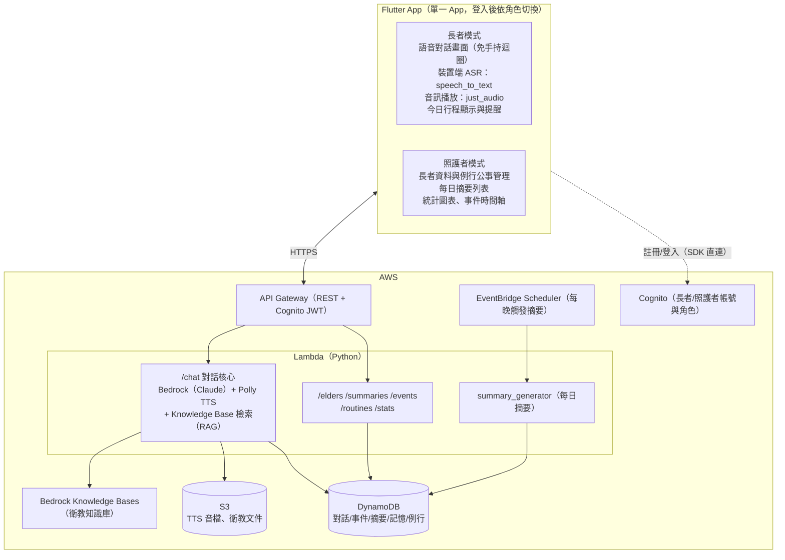

# 智慧長照陪伴 App — 系統開發框架

## Context

本文件定義智慧長照陪伴系統的開發框架，以必要功能為主；各功能的具體做法另行討論。系統分三大模組：**A 語音互動陪伴、B 生活記錄與智慧摘要、C 照護者資訊介面**。

已確認的決策：

- **App：Flutter**（單一 App，登入後依角色切換長者模式／照護者模式 → Module C 做在 App 內）
- **語言策略：中文先行、客語第二階段**
- **團隊強項：Python / AWS** → 架構原則是 **Flutter 端做薄、智慧邏輯放 AWS 後端（Python Lambda）**
- **IaC：Terraform**

## 系統架構



- **語音對話迴圈**：裝置端辨識（zh-TW）→ `/chat` 生成回覆 → 語音播放 → 自動再聆聽，全程免觸控
- **`/chat` API 同時接受 `{text}` 或 `{audio}`，中文與客語皆支援兩種輸入**（請求帶語言參數）：text 直接進對話流程；audio 由後端 ASR 轉文字後進同一流程

## API 一覽

| API | 用途 | 使用者 |
|---|---|---|
| `POST /chat` | 對話核心（中文/客語 × text/audio） | 長者模式 |
| `GET /elders` | 長者基本資料（長者模式載入自己的資訊與語言偏好；照護者查看） | 長者模式＋照護者模式 |
| `POST /elders` | 建立/管理長者資料（照護者模式兼管理後台） | 照護者模式 |
| `GET /summaries` | 每日摘要列表 | 照護者模式 |
| `POST /summaries/generate` | 手動觸發摘要生成（Demo 用） | 照護者模式 |
| `GET /events` | 生活事件（事件時間軸） | 照護者模式 |
| `GET /routines` | 例行事項與當日行程（兩端顯示、提醒與查看完成狀況） | 長者模式＋照護者模式 |
| `POST /routines` | 建立/管理例行事項（服藥時間、回診、約會）；手動確認完成（兩端皆可） | 長者模式（確認完成）＋照護者模式 |
| `GET /stats` | 統計（互動次數、例行公事完成、逐日趨勢） | 照護者模式 |

登入/註冊走 Cognito SDK 不經 API Gateway；TTS 音檔以 S3 presigned URL 回傳；衛教文件於部署時上傳 S3。

## 功能框架

| 功能 | 定位 |
|---|---|
| 語音互動陪伴（Module A） | 免手持中文語音對話，回應具情境感知（時間、節日、過往記憶），非固定腳本；長者可用語音查詢自己的紀錄（昨天吃了什麼、上次回診時間、今天有什麼行程） |
| 生活記錄與摘要（Module B） | 從對話自動擷取飲食/活動/睡眠/用藥/身心狀況等事件；每日自動生成固定分類的結構化摘要，涵蓋例行公事完成與未完成情況（另留手動觸發供 Demo） |
| AI 記憶系統（Module B） | 短期（當日對話）＋長期（跨日記憶）雙層記憶，讓 AI 記得長者的人事物與健康狀況 |
| 例行公事與提醒（Module B） | 照護者建立例行事項（每日服藥時間、每週回診、特定日期約會）；長者對話中提到的行程也自動寫入並直接生效；長者端與照護者端皆顯示當日行程並以 App 本地通知提醒；兩端皆可確認完成——長者口語回報自動完成（與生活事件對照）或手動確認，照護者亦可代為確認 |
| 照護者介面（Module C） | App 內照護者模式（兼管理後台）：長者資料管理、每日摘要、統計圖表 |
| 衛教知識庫（進階） | 公開衛教文件建成知識庫，AI 回應具備照護知識基礎；僅供參考、不做醫療診斷 |
| 事件時間軸（進階） | 照護者模式以時間軸檢視長者每日事件 |
| 家屬推播（進階，選做） | 每日摘要推播給家屬 |
| 客語互動（進階） | 客語語音辨識（第二階段） |
| PII 保護 | Cognito 認證、傳輸與靜態加密、首次啟動同意頁與資料保留政策、全部使用模擬 persona |

## 資料模型（DynamoDB）

| Table | 內容 |
|---|---|
| `elders` | 長者 persona（模擬資料） |
| `conversations` | 對話紀錄 |
| `elders` | 長者 persona 與綁定資料（照護者關聯、語言偏好、健康與生活習慣） |
| `conversations` | 對話紀錄（包含時間戳記、音訊 S3 Key 與三階段時序） |
| `events` | 結構化生活事件——「實際發生」的唯一紀錄，含例行公事完成紀錄（餵 Module B 與事件時間軸） |
| `daily_summaries` | AI 每日摘要 |
| `memories` | 長期記憶 |
| `routines` | 例行公事計畫（服藥時間、回診、約會）；完成狀態由 events 動態衍生 |

### `elders` 表基本 Schema

#### Key

| 名稱 | Key Schema | 用途 |
|---|---|---|
| Base table | PK `elder_id` (String) | 以長者唯一識別碼隔離資料 |

#### 欄位

| 欄位 | DynamoDB 型別 | 必填 | 說明 |
|---|---|---|---|
| `elder_id` | String | 是 | 長者唯一識別碼，格式 `eld_<12-byte-hex>`；由後端產生 |
| `name` | String | 是 | 長者真實姓名 |
| `nickname` | String | 否 | 長者暱稱或慣稱 |
| `birth_year` | Number | 否 | 出生年份 |
| `gender` | String | 否 | `male` \| `female` \| `other` |
| `lang_preference` | String | 是 | `zh-TW` \| `hak`；對話與 TTS 預設語言 |
| `address_region` | String | 否 | 居住區域，例如：台北市大安區 |
| `health_notes` | List[String] | 是 | 預設空陣列；健康狀況/病史備註標籤 |
| `family` | List[Object] | 是 | 預設空陣列；親友背景資訊（relation, name, note） |
| `habit_note` | String | 否 | 生活習慣與喜好備註 |
| `caregiver_ids` | List[String] | 是 | 預設空陣列；綁定之照護者 Cognito User ID 列表 |
| `created_at` | String | 是 | 建立時間，ISO 8601、台灣時區（`+08:00`） |
| `updated_at` | String | 是 | 最後更新時間，格式同 `created_at` |

長者範例：

```json
{
  "elder_id": "eld_001",
  "name": "陳阿蘭",
  "nickname": "阿蘭嬤",
  "birth_year": 1948,
  "gender": "female",
  "lang_preference": "zh-TW",
  "address_region": "台北市大安區",
  "health_notes": ["高血壓", "膝關節退化"],
  "family": [
    { "relation": "兒子", "name": "陳志明", "note": "在台北工作，每週三來訪" },
    { "relation": "孫子", "name": "小明", "note": "高中生" }
  ],
  "habit_note": "早睡早起，喜歡去公園散步、看歌仔戲",
  "caregiver_ids": ["cgr_001"],
  "created_at": "2026-07-01T10:00:00+08:00",
  "updated_at": "2026-07-01T10:00:00+08:00"
}
```

#### 寫入與查詢規則

- `elder_id` 一律由後端產生，格式為 `eld_` + `uuid4().hex[:12]`；App 或模型不得直接指定。
- `created_at` 與 `updated_at` 由後端自動補全；`PATCH /elders/{id}` 更新時自動刷新 `updated_at`。
- 空陣列欄位（`health_notes`, `family`, `caregiver_ids`）預設為空陣列；`POST /elders` 時未傳入即補 `[]`。
- `GET /elders`：照護者帳號回傳其 `caregiver_ids` 包含之所有長者；長者帳號回傳僅限自己一筆（`elder_id == token.elder_id`）。
- `GET /elders/{elder_id}`：依 `elder_id` 直接 GetItem；長者只能查自己、照護者只能查已綁定之長者。
- elders 不設定 TTL；資料保留與刪除依 PII 政策執行。資料表啟用 AWS owned key 靜態加密。

### `conversations` 表基本 Schema

#### Key

| 名稱 | Key Schema | 用途 |
|---|---|---|
| Base table | PK `elder_id` (String) + SK `created_at` (String) | 以長者隔離資料；依建立時間倒序排列，支援分頁查詢 |

#### 欄位

| 欄位 | DynamoDB 型別 | 必填 | 說明 |
|---|---|---|---|
| `elder_id` | String | 是 | 長者 ID；Base table partition key |
| `conversation_id` | String | 是 | 對話唯一識別碼，格式 `cnv_<12-byte-hex>`；由後端產生 |
| `created_at` | String | 是 | 對話建立時間，ISO 8601、台灣時區（`+08:00`）；Base table sort key |
| `source` | String | 是 | `elder_initiated`（長者主動）\| `system_routine_inquiry`（系統例行公事詢問） |
| `user_status` | String | 是 | `replied`（已回覆）\| `no_response`（逾時無回應） |
| `system_status` | String | 是 | `success`（成功）\| `failed`（處理失敗） |
| `error_message` | String | 否 | 系統失敗時之錯誤訊息 |
| `routine_id` | String | 否 | 若為系統 Routine 詢問，關聯之例行公事 ID |
| `lang` | String | 是 | 對話語言：`zh-TW` \| `hak` |
| `input_type` | String | 是 | 輸入類型：`text` \| `audio` |
| `ai_prompt_text` | String | 否 | 系統發起提醒之提示內文（AI 1）；長者主動發話時為 `null` |
| `elder_transcript` | String | 否 | 長者說的話 / 語音轉寫文字（Elder）；逾時無回應時為 `null` |
| `ai_respond_text` | String | 否 | AI 最終回應/確認內文（AI 2） |
| `ai_prompt_audio_s3_key` | String | 否 | 系統提醒語音 S3 物件路徑（AI 1） |
| `elder_audio_s3_key` | String | 否 | 長者原始錄音 S3 物件路徑（Elder） |
| `ai_respond_audio_s3_key` | String | 否 | AI 最終回應語音 S3 物件路徑（AI 2） |
| `prompt_sent_at` | String | 否 | 系統送出提醒發問之時間戳記（ISO 8601、+08:00） |
| `elder_received_at` | String | 否 | 接收到長者輸入之時間戳記；用於長者反應時間分析 |
| `ai_responded_at` | String | 否 | AI 推理完成送出回應之時間戳記；用於後端 Latency 分析 |
| `routines_updated` | Boolean | 是 | 本輪對話是否觸發例行公事狀態更新 |

對話範例：

```json
{
  "elder_id": "eld_001",
  "conversation_id": "cnv_01J8...",
  "created_at": "2026-07-14T09:04:58.000+08:00",
  "source": "elder_initiated",
  "user_status": "replied",
  "system_status": "success",
  "lang": "zh-TW",
  "input_type": "text",
  "ai_prompt_text": null,
  "elder_transcript": "我吃過血壓藥了，明天下午三點小明要帶我去看醫生",
  "ai_respond_text": "有按時吃藥真棒！明天下午三點小明帶你去看醫生，我幫你記下來了，明天會提醒你。",
  "ai_prompt_audio_s3_key": null,
  "elder_audio_s3_key": null,
  "ai_respond_audio_s3_key": "s3://bucket/ai_reply_01J8.mp3",
  "prompt_sent_at": null,
  "elder_received_at": "2026-07-14T09:04:59.000+08:00",
  "ai_responded_at": "2026-07-14T09:05:02.000+08:00",
  "routines_updated": true
}
```

#### 寫入與查詢規則

- `conversation_id` 與 `created_at` 一律由後端產生；`created_at` 格式為 ISO 8601 + 毫秒 + `+08:00`。
- `source`, `user_status`, `system_status`, `lang`, `input_type`, `routines_updated` 為必填預設值；`POST /chat` 處理完畢時統一補全。
- `GET /elders/{elder_id}/conversations`（擬議）：依 `elder_id` Query + `created_at` 倒序（`ScanIndexForward=false`）分頁。
- 對話記錄為不可變動的行為日誌；寫入後不應更新或刪除，僅供查詢與分析。
- S3 Key 欄位（`*_audio_s3_key`）儲存純路徑字串，由後端於取得 TTS 音檔或接收到語音時填寫；App 透過 `/chat` 回應取得 S3 presigned URL。
- conversations 不設定 TTL；保留期間依 PII 政策執行。資料表啟用 AWS owned key 靜態加密與 Point-in-Time Recovery。

### `events` 表基本 Schema

#### Key 與索引

| 名稱 | Key Schema | 用途 |
|---|---|---|
| Base table | PK `elder_id` (String) + SK `event_id` (String) | 以長者隔離資料；依事件 ID 冪等寫入或取得單筆 |
| GSI `events-by-time` | PK `elder_id` (String) + SK `event_time_key` (String) | 依長者與時間範圍倒序查詢事件時間軸；Projection 使用 `ALL` |

`event_time_key` 為後端產生的內部欄位，格式固定為 `<ts>#<event_id>`，例如 `2026-07-14T09:05:00.000+08:00#evt_01J8...`。`ts` 統一正規化成台灣時區、固定毫秒精度的 ISO 8601 字串，因此 DynamoDB 的字串排序即為時間排序；尾端加上 `event_id` 可避免同一毫秒發生多個事件時產生排序鍵碰撞。

MVP 不另建 `type` GSI：`GET /events` 先在 `events-by-time` 以 `elder_id` 與日期區間 Query，再以 FilterExpression 過濾 `type`。單一長者單日事件量低，此作法可減少索引與寫入成本；若未來需要跨長日期、高頻率分類查詢，再新增分類索引。

#### 欄位

| 欄位 | DynamoDB 型別 | 必填 | 說明 |
|---|---|---|---|
| `elder_id` | String | 是 | 長者 ID；Base table 與 GSI 的 partition key |
| `event_id` | String | 是 | 事件 ID，格式 `evt_<identifier>`；一般事件的 identifier 使用 ULID，routine 完成事件使用穩定雜湊；Base table sort key，由後端產生 |
| `event_time_key` | String | 是 | `<ts>#<event_id>`；僅供 `events-by-time` 排序與範圍查詢，不回傳給 App |
| `ts` | String | 是 | 事件實際發生時間，ISO 8601、台灣時區（`+08:00`） |
| `type` | String | 是 | `diet` \| `activity` \| `sleep` \| `medication` \| `wellbeing` \| `other` |
| `detail` | String | 是 | 可供時間軸、摘要與語音紀錄查詢使用的事件完整描述 |
| `source` | String | 是 | `conversation`（對話擷取）或 `manual`（App 手動確認） |
| `created_at` | String | 是 | 後端實際寫入時間；格式同 `ts`，用於稽核延遲，不代表發生時間 |
| `conversation_id` | String | 否 | `source=conversation` 時必填，追溯擷取來源；同一輪對話可產生多筆事件 |
| `routine_id` | String | 否 | 事件代表某次例行公事完成時必填 |
| `routine_date` | String | 否 | 有 `routine_id` 時必填，格式 `YYYY-MM-DD`，標識完成的是哪一天的 occurrence |
| `completed_by` | String | 否 | 有 `routine_id` 時必填：`conversation` \| `elder` \| `caregiver` |
| `confidence` | Number | 否 | 對話自動擷取信心值，範圍 0–1；手動事件不填 |
| `schema_version` | Number | 是 | Schema 版本，初始為 `1` |

事件範例：

```json
{
  "elder_id": "eld_001",
  "event_id": "evt_01J8...",
  "event_time_key": "2026-07-14T09:05:00.000+08:00#evt_01J8...",
  "ts": "2026-07-14T09:05:00.000+08:00",
  "type": "medication",
  "detail": "已服用血壓藥",
  "source": "conversation",
  "conversation_id": "cnv_01J8...",
  "routine_id": "rtn_001",
  "routine_date": "2026-07-14",
  "completed_by": "conversation",
  "confidence": 0.96,
  "created_at": "2026-07-14T09:05:02.000+08:00",
  "schema_version": 1
}
```

#### 寫入與查詢規則

- `event_id`、`event_time_key`、`created_at` 一律由後端產生，App 或模型不得直接指定；事件寫入後視為不可變的事實紀錄。
- 一般事件使用新的 `evt_<ULID>`；routine 完成事件依 `elder_id + routine_id + routine_date` 產生穩定的事件 ID，搭配條件式 Put，確保重試或重複確認不會建立兩筆完成事件。
- 只有同時帶有 `routine_id` 與 `routine_date` 的 event 才代表 routine occurrence 已完成。`routines` 不重複保存 `done/missed`：`done` 由對應 event 判定，`pending/missed` 依排程、目前時間與寬限期動態計算。
- `GET /events` 一律 Query `events-by-time`；日期邊界以台灣時間計算，`ScanIndexForward=false` 回傳最新事件優先，分頁沿用 DynamoDB `LastEvaluatedKey` 編碼的 `next_token`。
- `detail` 只保存事件摘要，不複製完整對話；需要追溯原文時透過 `conversation_id` 讀取 conversations，以減少 PII 重複儲存。
- events 不設定 TTL；資料保留與刪除依 PII 政策執行。資料表啟用 AWS owned key 靜態加密與 Point-in-Time Recovery。

### 資料邊界與寫入原則

- **共用擷取**：events / routines / memories 三類寫入來自 chat 流程中**同一次對話擷取**，一次擷取、分流入表，不做三套擷取邏輯
- **events**＝「一次發生的事」，有明確時間點（吃了藥、散步、提到疼痛、完成回診）——系統中「實際發生」與例行公事完成狀態的唯一紀錄
- **memories**＝「關於這個人的事實」，無特定時間點（家人稱謂、飲食偏好、健康特質）
- **routines**＝「計畫要發生的事」；有時間、需提醒或追蹤完成的一律存這裡，不雙寫 memories。對話擷取到完成事件時寫入 events；`done` 由 events 判定，`pending/missed` 依時間動態判定，不在 routines 寫死狀態；每日摘要記錄的是生成當下的快照
- **提醒**：長者端與照護者端 App 皆依 routines 排本地通知

## Repo 結構

```
ai-elder-care/
├── .kiro/          # Kiro 設定與 specs（視需要使用）
├── app/            # Flutter（elder/ caregiver/ 兩組頁面 + shared services）
├── backend/        # Python Lambda handlers（chat, summary, apis）
├── terraform/      # API GW, Lambda, DynamoDB, Cognito, EventBridge, S3, Bedrock KB
├── data/           # 模擬長者 persona、情境對話腳本、seed 腳本、knowledge/ 衛教文件
├── docs/           # 框架（含架構圖）、API 規格、使用者旅程、PII 說明
└── README.md
```

## Verification

- **端到端**：Android 實機/模擬器完成完整對話迴圈（說中文 → AI 語音回覆 → 自動再聆聽）
- **Module B**：手動觸發摘要，確認生成並顯示於照護者頁面
- **知識庫**：問衛教問題，確認回覆引用知識庫內容
- **例行公事**：照護者建立一筆服藥提醒，確認長者端與照護者端皆顯示且提醒觸發；長者口頭回報或任一端手動確認後，完成狀態同步顯示於兩端；對話中說「我明天下午三點要看醫生」，確認行程自動出現在兩端
- **紀錄查詢**：語音問「我昨天吃了什麼」，確認 AI 以實際紀錄回答
- **客語（第二階段）**：以測試音檔驗證辨識與回應
- 後端單元測試（pytest）
