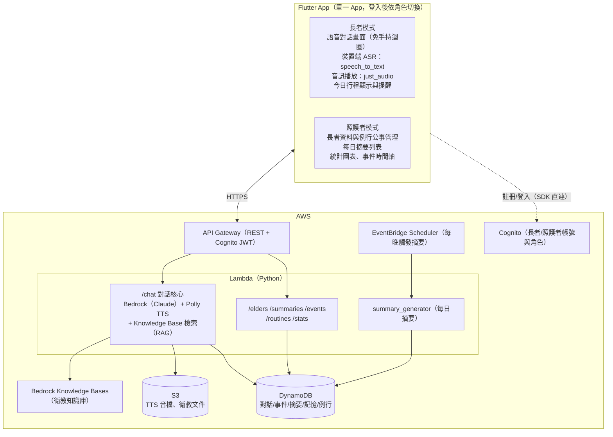

# 智慧長照陪伴 App — 系統開發框架

## Context

本文件定義智慧長照陪伴系統的開發框架，以必要功能為主；各功能的具體做法另行討論。系統分三大模組：**A 語音互動陪伴、B 生活記錄與智慧摘要、C 照護者資訊介面**。

已確認的決策：

- **App：Flutter**（單一 App，登入後依角色切換長者模式／照護者模式 → Module C 做在 App 內）
- **語言策略：中文先行、客語第二階段**
- **團隊強項：Python / AWS** → 架構原則是 **Flutter 端做薄、智慧邏輯放 AWS 後端（Python Lambda）**
- **IaC：Terraform**

## 系統架構



- **語音對話迴圈**：裝置端辨識（zh-TW）→ `/chat` 生成回覆 → 語音播放 → 自動再聆聽，全程免觸控
- **`/chat` API 同時接受 `{text}` 或 `{audio}`，中文與客語皆支援兩種輸入**（請求帶語言參數）：text 直接進對話流程；audio 由後端 ASR 轉文字後進同一流程

## API 一覽

| API | 用途 | 使用者 |
|---|---|---|
| `POST /chat` | 對話核心（中文/客語 × text/audio） | 長者模式 |
| `GET /elders` | 長者基本資料（長者模式載入自己的資訊與語言偏好；照護者查看） | 長者模式＋照護者模式 |
| `POST /elders` | 建立/管理長者資料（照護者模式兼管理後台） | 照護者模式 |
| `GET /summaries` | 每日摘要列表 | 照護者模式 |
| `POST /summaries/generate` | 手動觸發摘要生成（Demo 用） | 照護者模式 |
| `GET /events` | 生活事件（事件時間軸） | 照護者模式 |
| `GET /routines` | 例行事項與當日行程（兩端顯示、提醒與查看完成狀況） | 長者模式＋照護者模式 |
| `POST /routines` | 建立/管理例行事項（服藥時間、回診、約會）；手動確認完成（兩端皆可） | 長者模式（確認完成）＋照護者模式 |
| `GET /stats` | 統計（互動次數、例行公事完成、逐日趨勢） | 照護者模式 |

登入/註冊走 Cognito SDK 不經 API Gateway；TTS 音檔以 S3 presigned URL 回傳；衛教文件於部署時上傳 S3。

## 功能框架

| 功能 | 定位 |
|---|---|
| 語音互動陪伴（Module A） | 免手持中文語音對話，回應具情境感知（時間、節日、過往記憶），非固定腳本；長者可用語音查詢自己的紀錄（昨天吃了什麼、上次回診時間、今天有什麼行程） |
| 生活記錄與摘要（Module B） | 從對話自動擷取飲食/活動/睡眠/用藥/身心狀況等事件；每日自動生成固定分類的結構化摘要，涵蓋例行公事完成與未完成情況（另留手動觸發供 Demo） |
| AI 記憶系統（Module B） | 短期（當日對話）＋長期（跨日記憶）雙層記憶，讓 AI 記得長者的人事物與健康狀況 |
| 例行公事與提醒（Module B） | 照護者建立例行事項（每日服藥時間、每週回診、特定日期約會）；長者對話中提到的行程也自動寫入並直接生效；長者端與照護者端皆顯示當日行程並以 App 本地通知提醒；兩端皆可確認完成——長者口語回報自動完成（與生活事件對照）或手動確認，照護者亦可代為確認 |
| 照護者介面（Module C） | App 內照護者模式（兼管理後台）：長者資料管理、每日摘要、統計圖表 |
| 衛教知識庫（進階） | 公開衛教文件建成知識庫，AI 回應具備照護知識基礎；僅供參考、不做醫療診斷 |
| 事件時間軸（進階） | 照護者模式以時間軸檢視長者每日事件 |
| 家屬推播（進階，選做） | 每日摘要推播給家屬 |
| 客語互動（進階） | 客語語音辨識（第二階段） |
| PII 保護 | Cognito 認證、傳輸與靜態加密、首次啟動同意頁與資料保留政策、全部使用模擬 persona |

## 資料模型（DynamoDB）

| Table | 內容 |
|---|---|
| `elders` | 長者 persona（模擬資料） |
| `conversations` | 對話紀錄 |
| `events` | 結構化生活事件——「實際發生」的唯一紀錄，含例行公事完成紀錄（餵 Module B 與事件時間軸） |
| `daily_summaries` | AI 每日摘要 |
| `memories` | 長期記憶 |
| `routines` | 例行公事計畫（服藥時間、回診、約會）與完成狀態（與 events 同步更新） |

### 資料邊界與寫入原則

- **共用擷取**：events / routines / memories 三類寫入來自 chat 流程中**同一次對話擷取**，一次擷取、分流入表，不做三套擷取邏輯
- **events**＝「一次發生的事」，有明確時間點（吃了藥、散步、提到疼痛、完成回診）——系統中「實際發生」的唯一紀錄
- **memories**＝「關於這個人的事實」，無特定時間點（家人稱謂、飲食偏好、健康特質）
- **routines**＝「計畫要發生的事」；有時間、需提醒或追蹤完成的一律存這裡，不雙寫 memories。完成狀態與 events **在同一次對話處理中一併更新**（擷取到對應事件時兩表同時寫入）；「未完成/逾期」不寫死，查詢時依時間動態判定；每日摘要記錄的是生成當下的快照
- **提醒**：長者端與照護者端 App 皆依 routines 排本地通知

## Repo 結構

```
ai-elder-care/
├── .kiro/          # Kiro 設定與 specs（視需要使用）
├── app/            # Flutter（elder/ caregiver/ 兩組頁面 + shared services）
├── backend/        # Python Lambda handlers（chat, summary, apis）
├── terraform/      # API GW, Lambda, DynamoDB, Cognito, EventBridge, S3, Bedrock KB
├── data/           # 模擬長者 persona、情境對話腳本、seed 腳本、knowledge/ 衛教文件
├── docs/           # 架構圖、使用者旅程、PII 說明
└── README.md
```

## Verification

- **端到端**：Android 實機/模擬器完成完整對話迴圈（說中文 → AI 語音回覆 → 自動再聆聽）
- **Module B**：手動觸發摘要，確認生成並顯示於照護者頁面
- **知識庫**：問衛教問題，確認回覆引用知識庫內容
- **例行公事**：照護者建立一筆服藥提醒，確認長者端與照護者端皆顯示且提醒觸發；長者口頭回報或任一端手動確認後，完成狀態同步顯示於兩端；對話中說「我明天下午三點要看醫生」，確認行程自動出現在兩端
- **紀錄查詢**：語音問「我昨天吃了什麼」，確認 AI 以實際紀錄回答
- **客語（第二階段）**：以測試音檔驗證辨識與回應
- 後端單元測試（pytest）
